# CHƯƠNG 3: PHÂN TÍCH VÀ THIẾT KẾ HỆ THỐNG

Chương này trình bày quá trình phân tích và thiết kế hệ thống HomeStay: từ đặc tả yêu cầu,
các biểu đồ use case, biểu đồ lớp thực thi, thiết kế cơ sở dữ liệu, các biểu đồ tuần tự cho
nghiệp vụ chính, cho tới thiết kế giao diện.

Toàn bộ 16 sơ đồ trong chương được sinh bằng chương trình `docs/anh/ve-so-do.mjs` từ chính mã
nguồn của dự án — nội dung sơ đồ lấy từ endpoint thật, lớp thực thể thật và luồng nghiệp vụ
thật. Cách làm này đảm bảo sơ đồ không bao giờ lệch với mã nguồn sau này.

## 3.1. Đặc tả yêu cầu phần mềm

### 3.1.1. Xác định các tác nhân

Hệ thống HomeStay có **hai tác nhân**:

| Tác nhân | Mô tả |
|----------|-------|
| **Khách hàng (CUSTOMER)** | Người dùng có thể đăng ký, đăng nhập, tìm kiếm phòng, xem thông tin phòng, đặt phòng, quản lý đơn của mình, chọn phương thức thanh toán, xem thông báo và đánh giá sau khi hoàn thành lưu trú. |
| **Quản trị viên (ADMIN)** | Người quản lý toàn bộ dữ liệu của hệ thống: cơ sở, phòng, hình ảnh, tiện nghi, khách hàng, đơn đặt phòng, đánh giá, thanh toán và xem thống kê. |

Hệ thống cố ý **không tách thêm vai trò nhân viên**. Trong thực tế các thao tác nhận phòng,
trả phòng hay cập nhật trạng thái phòng do nhân viên thực hiện, nhưng tách vai trò đó ra chỉ
làm phân quyền phức tạp hơn mà không thêm giá trị nghiệp vụ cho đồ án. Mọi thao tác vận hành
được giao cho quản trị viên.

### 3.1.2. Yêu cầu chức năng

Hệ thống được chia thành 17 nhóm chức năng, 9 nhóm phía khách hàng và 7 nhóm phía quản trị
viên, cộng một nhóm thống kê dùng chung.

**Bảng 3.1. Danh sách chức năng phía khách hàng**

| STT | Tên chức năng | Mô tả ngắn gọn |
|-----|---------------|-----------------|
| 1 | Đăng ký và đăng nhập | Cho phép tạo tài khoản, đăng nhập và truy cập hệ thống theo quyền |
| 2 | Tìm kiếm và lọc phòng | Tìm theo cơ sở, khoảng thời gian, số khách, khoảng giá và sắp xếp |
| 3 | Xem chi tiết phòng | Hiển thị hình ảnh, giá, tiện nghi, mô tả và trạng thái phòng |
| 4 | Kiểm tra phòng trống | Kiểm tra khả năng đặt phòng theo khoảng thời gian |
| 5 | Đặt phòng theo giờ | Cho phép đặt phòng tối thiểu 3 giờ, tính tiền theo giờ |
| 6 | Đặt phòng theo ngày | Đặt theo số ngày, tính tiền theo ngày |
| 7 | Quản lý đơn của tôi và hủy đơn | Xem, lọc, tìm theo mã đơn và hủy đơn chờ xác nhận |
| 8 | Đánh giá và nhận xét | Đánh giá thang 5 sao kèm nhận xét sau khi hoàn thành lưu trú |
| 9 | Thanh toán | Xem phiếu thu và chọn phương thức thanh toán mong muốn |
| 10 | Thông báo | Xem thông báo hệ thống sinh ra khi trạng thái đơn thay đổi |

**Bảng 3.2. Danh sách chức năng phía quản trị viên**

| STT | Tên chức năng | Mô tả ngắn gọn |
|-----|---------------|-----------------|
| 11 | Dashboard thống kê | Thống kê doanh thu, số đơn, tỷ lệ lấp đầy và biểu đồ theo thời gian |
| 12 | Quản lý cơ sở | Thêm, sửa, xoá địa điểm homestay |
| 13 | Quản lý phòng, ảnh và tiện nghi | Thêm, sửa, xoá phòng kèm hình ảnh và tiện nghi |
| 14 | Quản lý vòng đời đơn đặt phòng | Xác nhận, từ chối, nhận phòng, trả phòng |
| 15 | Quản lý khách hàng | Xem hồ sơ và khoá hoặc mở khoá tài khoản |
| 16 | Quản lý đánh giá | Duyệt và ẩn đánh giá không phù hợp |
| 17 | Quản lý thanh toán | Lọc phiếu thu, đối chiếu số tiền và xác nhận đã thu |

### 3.1.3. Yêu cầu phi chức năng

| STT | Yêu cầu | Cách đáp ứng |
|-----|----------|--------------|
| 1 | **Hiệu năng** | Danh sách phân trang, có chỉ mục cho các cột lọc và sắp xếp, truy vấn đọc dùng kỹ thuật không theo dõi |
| 2 | **Bảo mật** | Mật khẩu lưu dạng BCrypt hash, xác thực bằng JWT, định danh người dùng lấy từ token chứ không lấy từ dữ liệu gửi lên |
| 3 | **Phân quyền** | Kiểm tra quyền ở cả tầng API (attribute) và tầng giao diện (route bảo vệ) |
| 4 | **Trải nghiệm người dùng** | Giao diện đáp ứng cho máy tính, máy tính bảng và điện thoại; mọi danh sách có đủ ba trạng thái đang tải, lỗi và không có dữ liệu |
| 5 | **Tính nhất quán** | Thao tác nhiều bảng nằm trong một transaction; khi phần sau thất bại thì toàn bộ hoàn tác |
| 6 | **Không lộ dữ liệu nội bộ** | Mọi API trả về đối tượng DTO định nghĩa trước, không trả thẳng đối tượng entity; giao diện không hiển thị khoá chính |
| 7 | **Dễ bảo trì** | Quy tắc nghiệp vụ nằm trong Service dưới dạng hàm ngắn, kiểm thử được độc lập |

## 3.2. Biểu đồ use case

### 3.2.1. Biểu đồ use case tổng quát

*Hình 3.1. Biểu đồ use case tổng quát của hệ thống HomeStay*

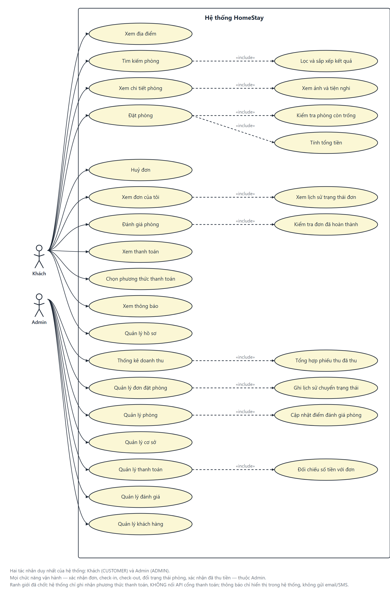

Biểu đồ tổng quát thể hiện toàn bộ phạm vi chức năng và hai tác nhân. Các quan hệ `«include»`
thể hiện việc một chức năng luôn kéo theo chức năng khác — ví dụ đặt phòng không thể tách rời
khỏi việc kiểm tra phòng trống.

### 3.2.2. Biểu đồ use case quản lý tài khoản

*Hình 3.2. Biểu đồ use case quản lý tài khoản*

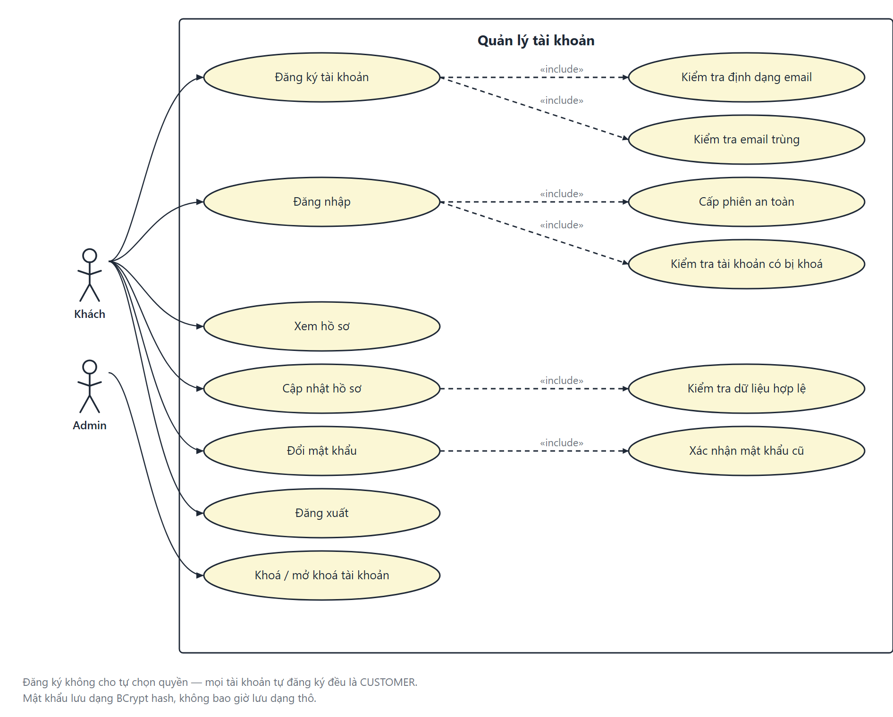

### 3.2.3. Biểu đồ use case tìm kiếm và đặt phòng

*Hình 3.3. Biểu đồ use case tìm kiếm và đặt phòng*

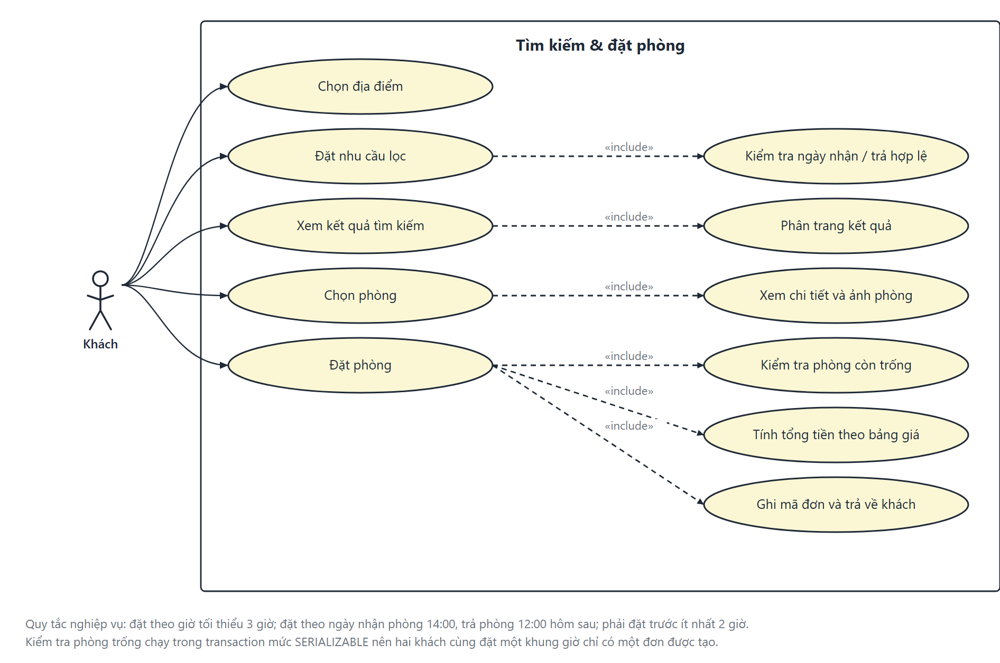

### 3.2.4. Biểu đồ use case quản lý đặt phòng

*Hình 3.4. Biểu đồ use case quản lý đặt phòng*

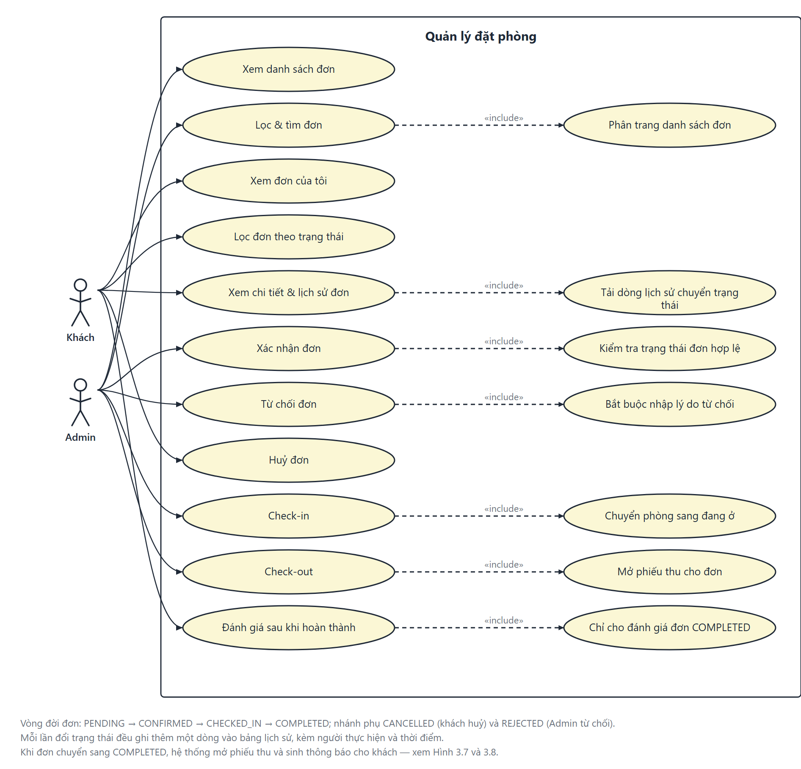

### 3.2.5. Biểu đồ use case quản lý phòng

*Hình 3.5. Biểu đồ use case quản lý phòng*

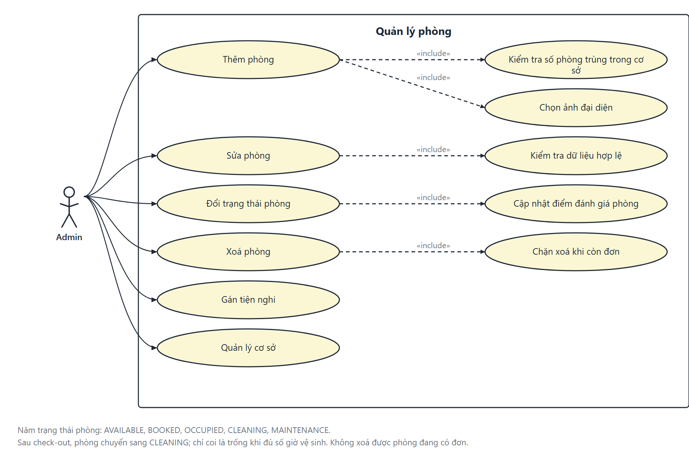

### 3.2.6. Biểu đồ use case thanh toán

*Hình 3.6. Biểu đồ use case thanh toán*

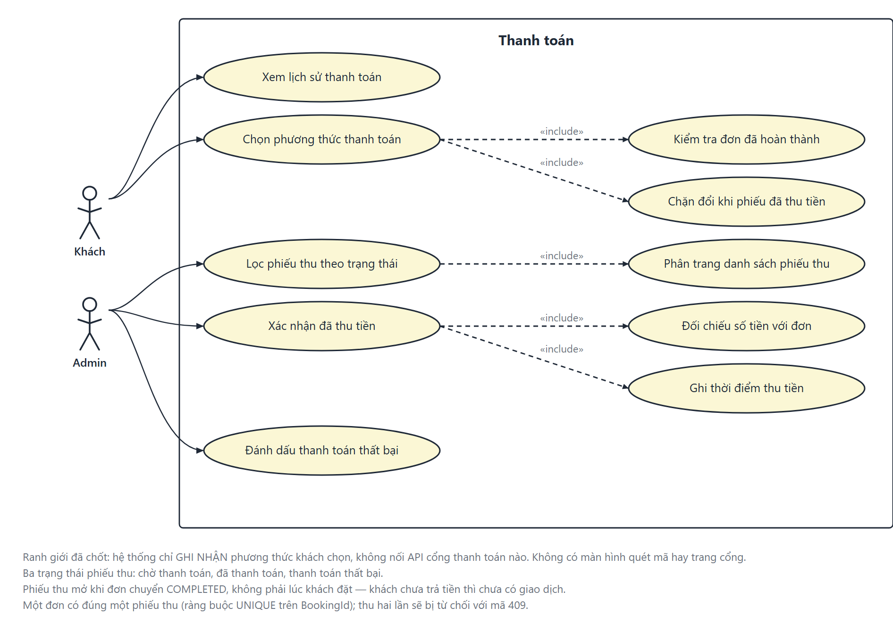

### 3.2.7. Biểu đồ use case thông báo

*Hình 3.7. Biểu đồ use case thông báo*

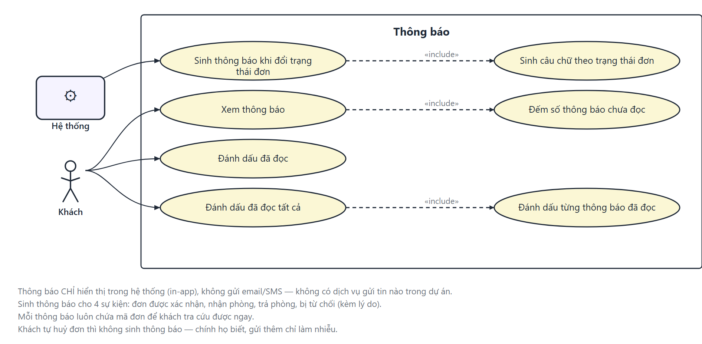

### 3.2.8. Biểu đồ use case quản trị hệ thống

*Hình 3.8. Biểu đồ use case quản trị hệ thống*

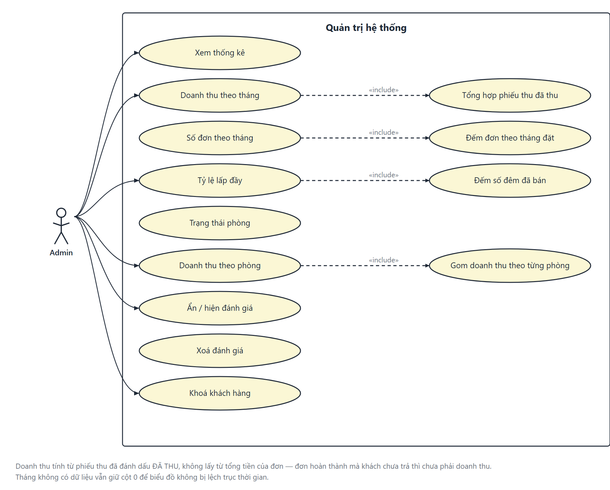

## 3.3. Biểu đồ lớp thực thi

*Hình 3.9. Biểu đồ lớp thực thi của hệ thống HomeStay*

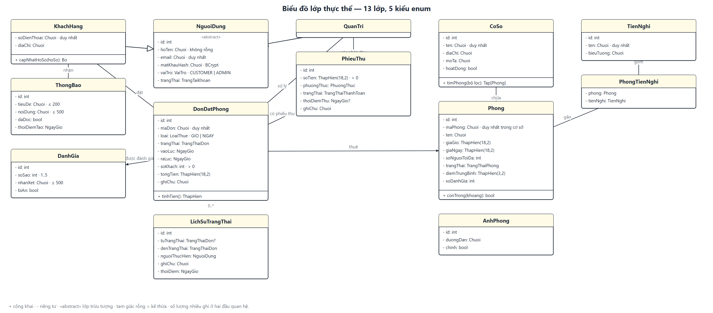

Biểu đồ thể hiện 13 lớp thực thể cùng các thuộc tính và phương thức chính, quan hệ kế
thừa, và 5 kiểu dữ liệu liệt kê. Có ba điểm đáng chú ý:

- **Phân tầng rõ ràng.** Các lớp `TaoDonAsync`, `KiemTraTrongAsync`, `DanhDauDaThuAsync` chỉ
  tồn tại ở tầng nghiệp vụ. Tầng điều khiển chỉ tiếp nhận và trả lời, không chứa quy tắc.
- **Cơ sở dữ liệu không biết nghiệp vụ.** Bảng `Bookings` lưu `TongTien` như một con số, không
  biết công thức tính ra con số đó. Nhờ vậy có thể đổi công thức tính tiền mà không phải sửa
  dữ liệu cũ.
- **Quy tắc tập trung ở chỗ đúng.** Ràng buộc thời gian, ràng buộc số tiền và ràng buộc một
  đơn chỉ có một đánh giá được khai báo tập trung trong một hằng số `BookingRules`, `PaymentRules`
  và `ReviewRules`, thay vì rải khắp các hàm.

## 3.4. Thiết kế cơ sở dữ liệu

*Hình 3.10. Sơ đồ ERD của hệ thống HomeStay — 11 bảng, 13 khoá ngoại*

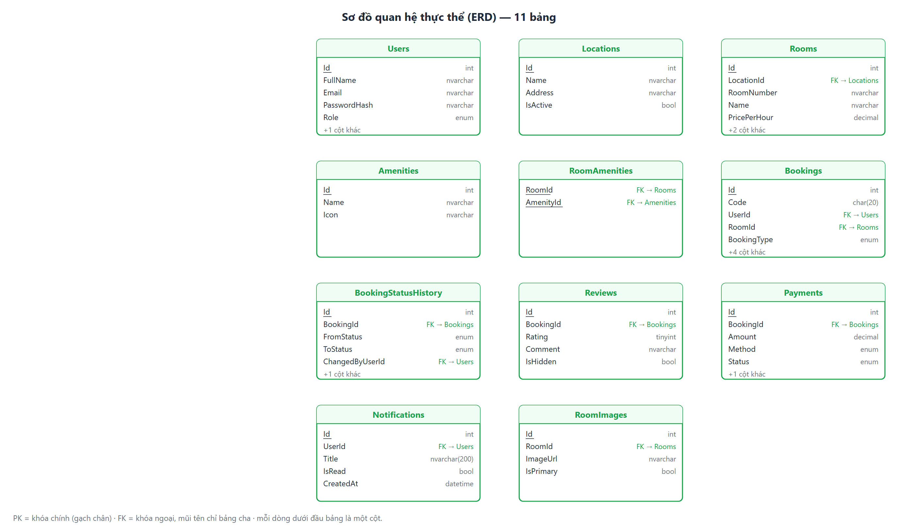

**Bảng 3.3. Danh sách 11 bảng và ý nghĩa*

| Bảng | Ý nghĩa | Số khoá ngoại |
|------|---------|----------------|
| `Users` | Tài khoản khách hàng và quản trị viên, lưu mật khẩu dạng BCrypt hash | — |
| `Locations` | Cơ sở homestay: tên, địa chỉ, mô tả, tiện ích chung | — |
| `Rooms` | Phòng thuộc cơ sở: mã phòng, loại, sức chứa, giá theo giờ và ngày, trạng thái | 1 |
| `RoomImages` | Hình ảnh của phòng | 1 |
| `Amenities` | Danh mục tiện nghi | — |
| `RoomAmenities` | Bảng nối phòng với tiện nghi | 2 |
| `Bookings` | Đơn đặt phòng: mã đơn, khoảng thời gian, loại thuê, tổng tiền, trạng thái | 2 |
| `BookingStatusHistory` | Lịch sử từng lần chuyển trạng thái của đơn, ghi rõ ai xử lý | 2 |
| `Reviews` | Đánh giá và nhận xét của khách, thang 5 sao | 2 |
| `Payments` | Phiếu thu: phương thức thanh toán, số tiền, trạng thái thu | 2 |
| `Notifications` | Thông báo gửi tới từng người dùng, kèm cờ đã đọc | 1 |

**Vài quyết định thiết kế đáng giải thích:**

1. **`Bookings` lưu `TongTien` chứ không tính lúc hiển thị.** Tổng tiền được chốt tại thời
   điểm đặt. Nếu tính lúc xem, việc giá phòng thay đổi giữa lúc đặt và lúc xem sẽ làm khách
   thấy một con số khác với số tiền đã cam kết.

2. **`Payments` có ràng buộc `UNIQUE` trên `BookingId`.** Một đơn chỉ có một phiếu thu. Đây là
   ràng buộc ở tầng cơ sở dữ liệu, nghĩa là **ngay cả khi mã nguồn có lỗi** thì MySQL vẫn từ
   chối. Nếu chỉ kiểm tra bằng mã, một lỗi đua lệnh trong giao diện hoặc thao tác gõ tay vào
   cơ sở dữ liệu vẫn có thể tạo ra hai phiếu.

3. **`BookingStatusHistory` tách riêng thay vì nhét vào `Bookings`.** Bảng lịch sử cho phép
   lưu mọi lần chuyển trạng thái, không chỉ trạng thái hiện tại. Nhờ đó khi khách khiếu nại
   "đơn của tôi bị hủy lúc nào, ai hủy", câu trả lời nằm ngay trong bảng này.

4. **`Notifications` có hai chỉ mục.** Một chỉ mục trên cặp `UserId, CreatedAt` để lấy thông
   báo mới nhất của một người dùng, và một chỉ mục trên cặp `UserId, IsRead` để đếm số thông
   báo chưa đọc. Hai truy vấn này chạy ở mọi lần tải trang nên phải có chỉ mục riêng.

5. **Kiểu dữ liệu liệt kê lưu dạng chuỗi.** Ví dụ trạng thái đơn lưu dạng `varchar(20)` với
   giá trị `PENDING`, `CONFIRMED`. Khi thêm trạng thái mới, câu lệnh `ALTER TABLE` chỉ cần
   một dòng thay vì phải xử lý kiểu số nguyên.

## 3.5. Biểu đồ tuần tự

Sáu biểu đồ dưới đây mô tả luồng xử lý của sáu nghiệp vụ chính. Trong mỗi biểu đồ:

- Thanh màu xanh dọc theo đường đời cho biết đối tượng nào đang xử lý.
- Mũi tên liền là lời gọi, mũi tên nét đứt là trả về kết quả.
- Khối `alt` thể hiện nhánh rẽ điều kiện.
- Số thứ tự thông điệp được sinh tự động theo chiều sâu lồng nhau, nên `1.1.1` là lời gọi con
  của `1.1`.

### 3.5.1. Đăng nhập

*Hình 3.11. Biểu đồ tuần tự chức năng đăng nhập*

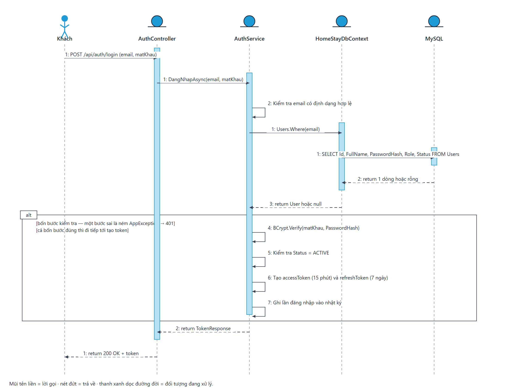

Điểm đáng chú ý là bốn bước kiểm tra diễn ra liên tiếp trong `AuthService`: định dạng email,
đối chiếu mật khẩu bằng BCrypt, kiểm tra trạng thái tài khoản, rồi mới tạo token. Chỉ cần một
trong bốn bước sai là ném ra ngoại lệ và trả về mã 401 với thông báo chung chung, tránh việc
đoán xem email có tồn tại hay không.

### 3.5.2. Tìm kiếm phòng

*Hình 3.12. Biểu đồ tuần tự chức năng tìm kiếm phòng*

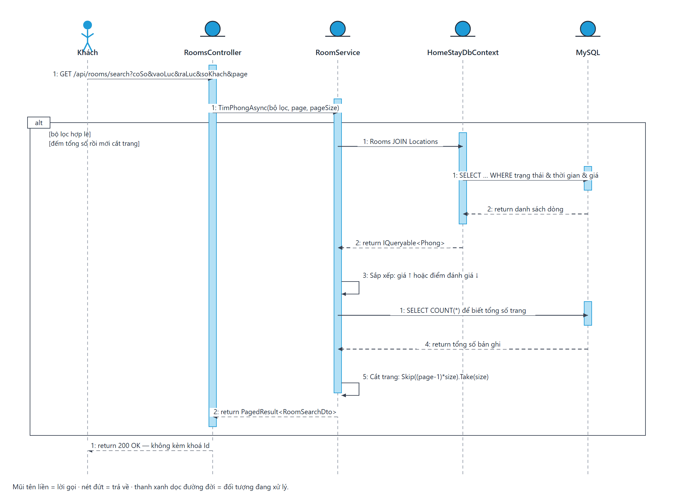

### 3.5.3. Đặt phòng

*Hình 3.13. Biểu đồ tuần tự chức năng đặt phòng*

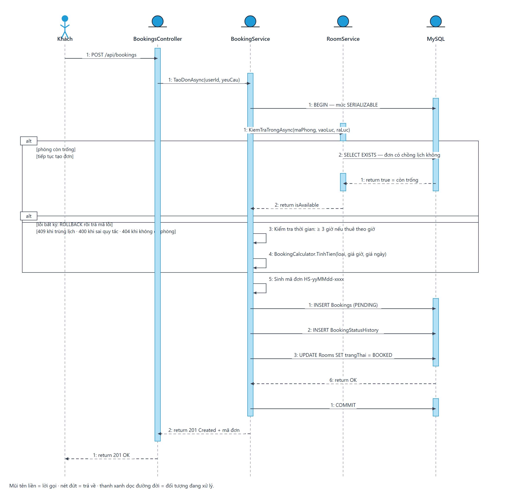

Đây là nghiệp vụ quan trọng nhất của hệ thống. Toàn bộ quá trình tạo đơn, ghi lịch sử và đổi
trạng thái phòng nằm trong **một giao dịch ở mức cô lập mạnh**. Hình thức trả về mã 409 khi
phòng đã có người đặt là kết quả của việc kiểm tra chồng lấn khoảng thời gian — không phải
kiểm tra trạng thái phòng.

Cách kiểm tra là: đơn mới chồng lấn đơn cũ khi thời gian nhận của đơn mới **nhỏ hơn** thời
gian trả của đơn cũ, và thời gian trả của đơn mới **lớn hơn** thời gian nhận của đơn cũ. Vì
vậy khách trả phòng lúc 12:00 thì khách mới được nhận phòng lúc 12:00 — hai khoảng chạm biên
không tính là trùng nhau.

### 3.5.4. Nhận phòng và trả phòng

*Hình 3.14. Biểu đồ tuần tự chức năng nhận phòng và trả phòng*

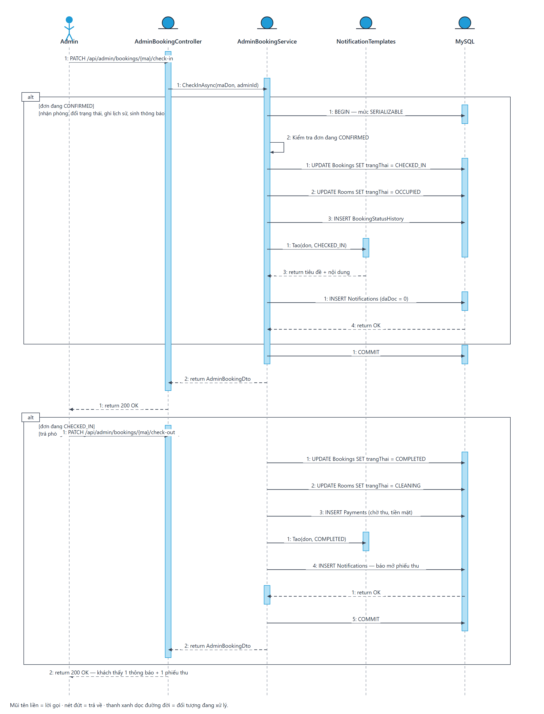

Hai nhánh trong cùng một biểu đồ thể hiện một điểm thiết kế quan trọng: **trả phòng mở phiếu
thu, không phải khách đặt phòng**. Đơn chuyển sang hoàn thành là lúc khách đã trả phòng, tiền
chưa thu, nên hệ thống mở một phiếu thu ở trạng thái chờ thu. Cùng lúc đó hệ thống sinh thông
báo cho khách trong **cùng transaction**, nên không thể xảy ra tình huống đơn đã trả phòng mà
khách không nhận được thông báo.

### 3.5.5. Quản lý phòng

*Hình 3.15. Biểu đồ tuần tự chức năng quản lý phòng*

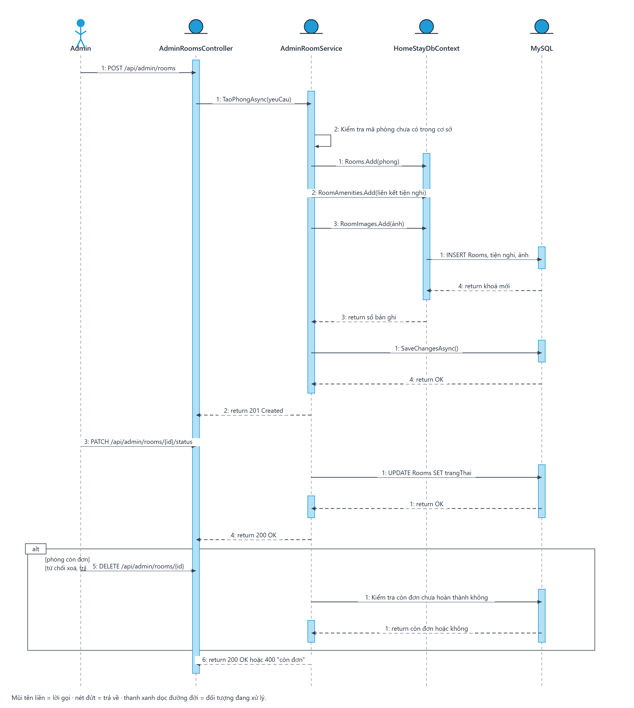

### 3.5.6. Thanh toán

*Hình 3.16. Biểu đồ tuần tự chức năng thanh toán*

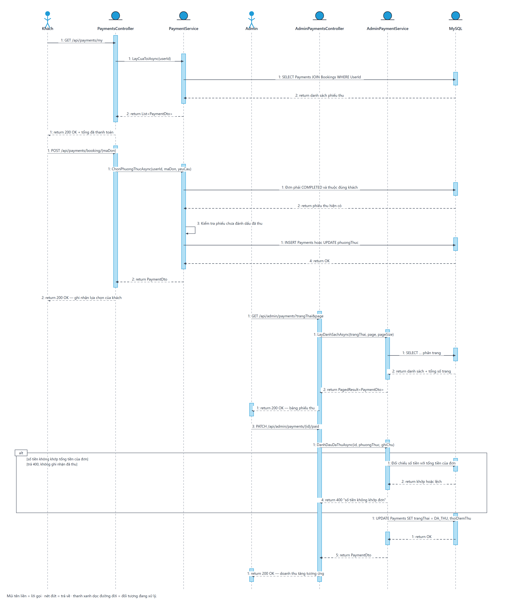

Biểu đồ có hai nhóm tác nhân: nhóm trên là khách chọn phương thức thanh toán, nhóm dưới là
quản trị viên đối chiếu và xác nhận đã thu. Trước khi ghi nhận đã thu, hệ thống **đối chiếu số
tiền phiếu thu với tổng tiền của đơn**; lệch thì trả về 400 và không ghi nhận, tránh việc
bấm nhầm làm sai sổ.

## 3.6. Thiết kế giao diện

### 3.6.1. Giao diện trang chủ

*Hình 3.17. Giao diện trang chủ HomeStay*

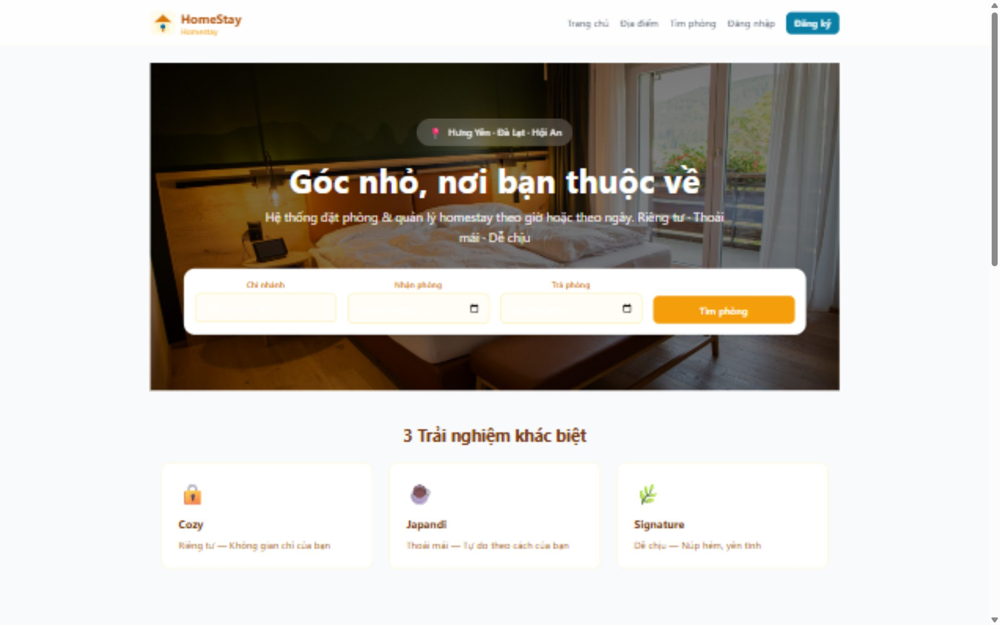

### 3.6.2. Giao diện tìm kiếm phòng

*Hình 3.18. Giao diện tìm kiếm và lọc phòng*

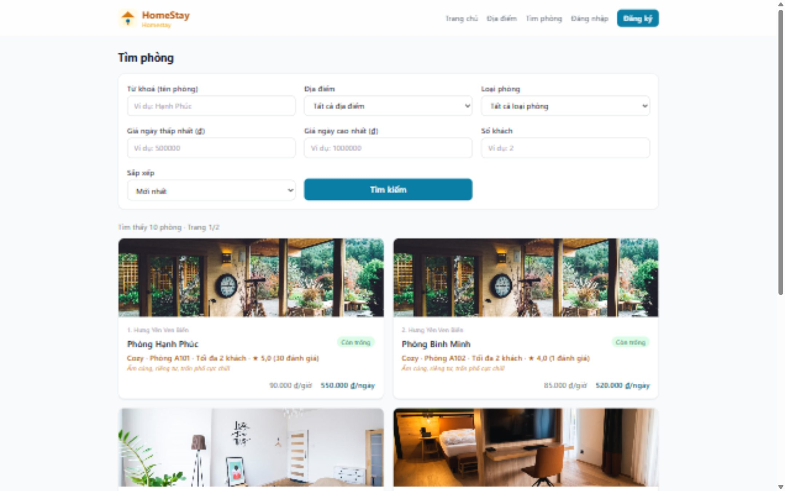

### 3.6.3. Giao diện chi tiết phòng

*Hình 3.19. Giao diện chi tiết phòng*

### 3.6.4. Giao diện đặt phòng

*Hình 3.20. Giao diện đặt phòng theo giờ hoặc theo ngày*

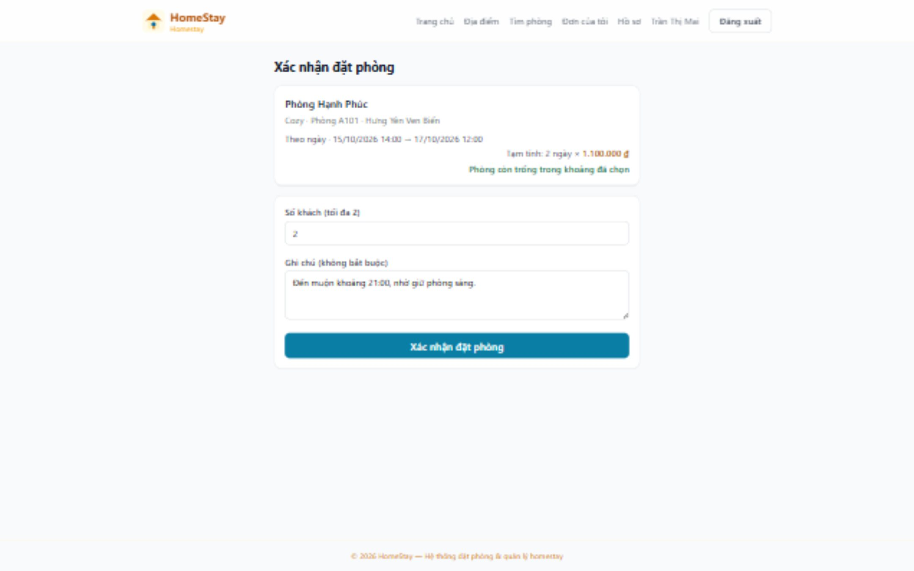

### 3.6.5. Giao diện quản lý đơn đặt phòng

*Hình 3.21. Giao diện quản lý đơn đặt phòng phía quản trị viên*

### 3.6.6. Giao diện quản trị hệ thống

*Hình 3.22. Giao diện trang thống kê phía quản trị viên*

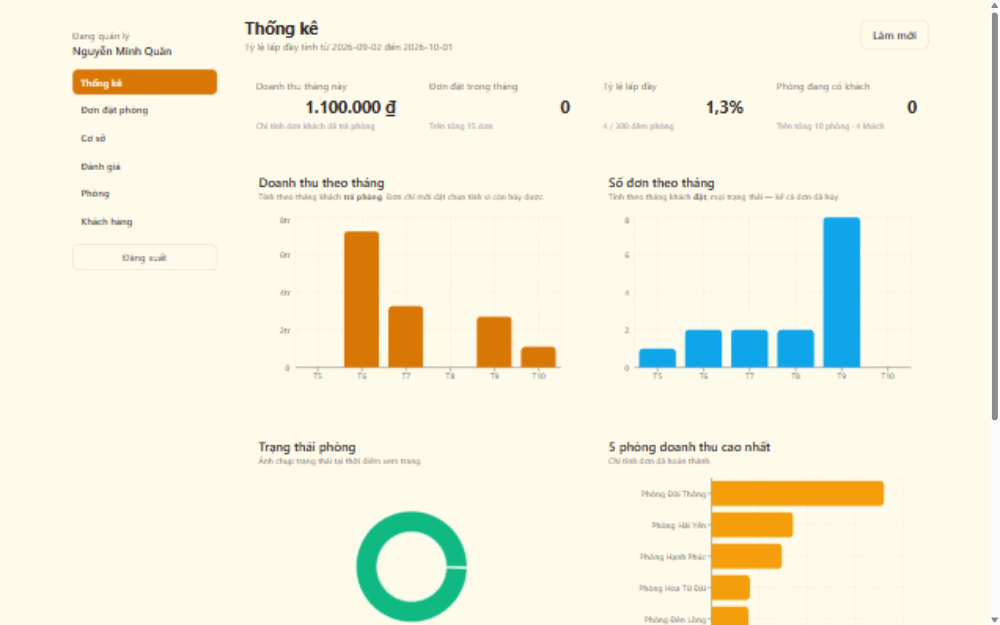

### 3.6.7. Giao diện quản lý phòng

*Hình 3.23. Giao diện quản lý phòng phía quản trị viên*

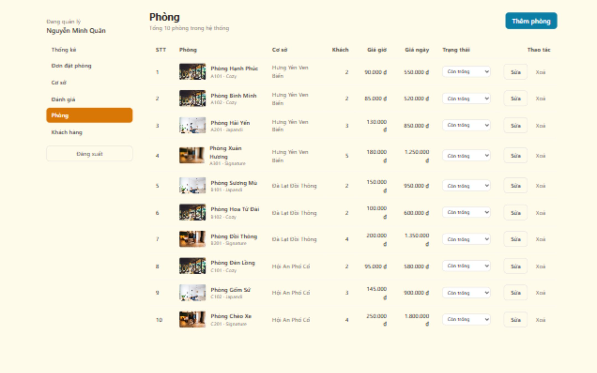

**Quy tắc trình bày được áp dụng thống nhất trên toàn bộ giao diện:**

| Loại dữ liệu | Cách hiển thị |
|---------------|----------------|
| Chữ, tên, địa chỉ, mô tả | Căn trái |
| Số, tiền, diện tích, số phòng, số khách | Căn phải, dùng lớp `.number-vn` |
| Tiền Việt Nam | Định dạng `500.000 ₫` bằng dấu chấm phân cách nghìn |
| Số thứ tự | Tự tính `index + 1 + trang * số bản ghi mỗi trang` |
| Khoá chính nội bộ | **Không bao giờ hiển thị** |

Không hiển thị khoá chính là quy tắc quan trọng: người dùng chỉ cần **mã đơn** dạng
`HS-261110-5383` để tra cứu và trao đổi, không cần biết khoá số của hàng trong bảng. Nhờ vậy
khoá chính có thể đổi (chẳng hạn khi chuyển từ số nguyên sang khoá tự tăng theo kiểu khác)
mà không làm hỏng bất cứ đường dẫn nào mà người dùng đã lưu.