# CHƯƠNG 4: TRIỂN KHAI VÀ KIỂM THỬ HỆ THỐNG

**Học viên:** Nguyễn Hải Nam — 12523W.1

Chương này trình bày kết quả triển khai từng chức năng của hệ thống **HomeStay** trên
giao diện thực tế, sau đó trình bày phương pháp kiểm thử và cách đóng gói, chạy ứng dụng.

Toàn bộ hình trong chương được chụp từ hệ thống đang chạy thật, không dùng hình minh hoạ.

---

## 4.1. TRIỂN KHAI CÁC CHỨC NĂNG CHO KHÁCH HÀNG

Hệ thống có **2 tác nhân**: khách hàng (`CUSTOMER`) và quản trị viên (`ADMIN`).
Mục 4.1 trình bày 7 nhóm chức năng phía khách hàng.

### 4.1.1. Đăng ký và đăng nhập

*Hình 4.1. Màn hình đăng nhập*

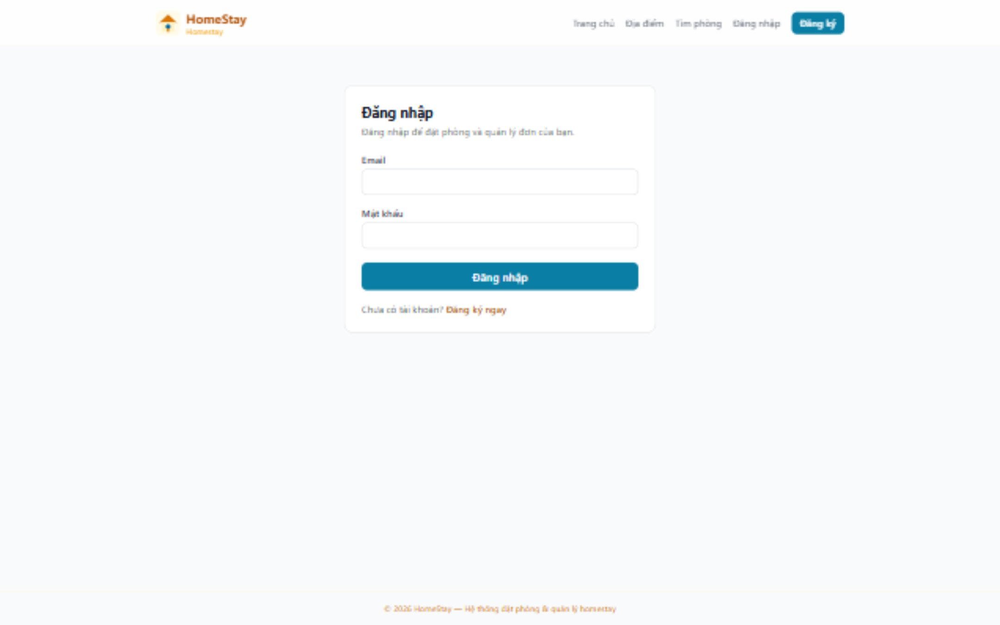

*Hình 4.2. Màn hình đăng ký tài khoản mới*

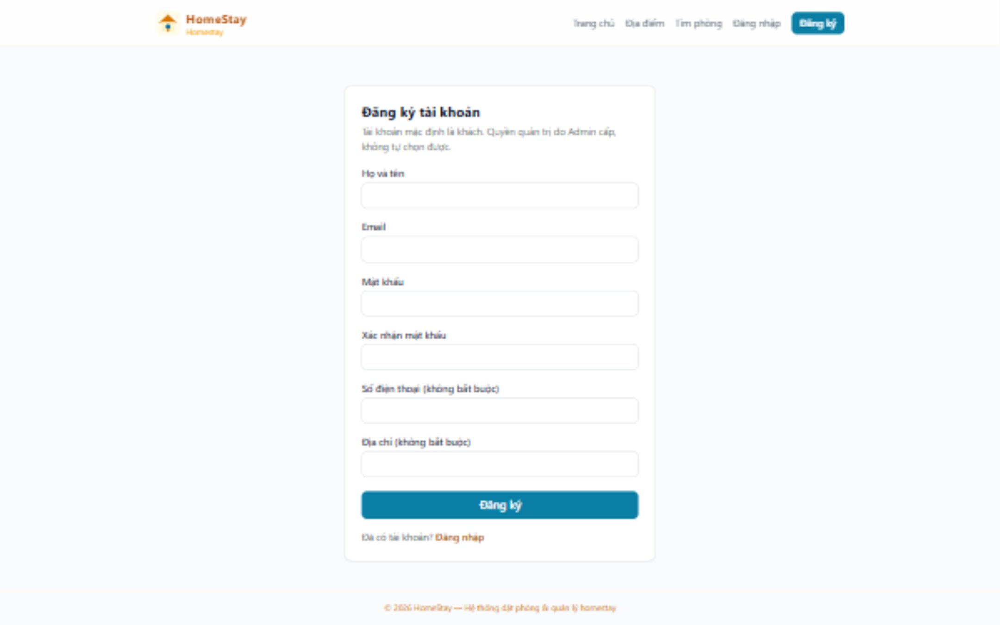

Khách truy cập hệ thống qua địa chỉ `http://localhost:5174`. Các trang không yêu cầu
đăng nhập (trang chủ, danh sách địa điểm, tìm phòng, chi tiết phòng) hiển thị ngay;
muốn đặt phòng hoặc xem đơn của mình thì phải đăng nhập. Người chưa có tài khoản
bấm "Đăng ký ngay" để sang màn hình đăng ký.

Sau khi đăng nhập thành công, hệ thống trả về **cặp token** (access token và refresh
token) kèm thông tin người dùng. Access token có thời hạn 60 phút; refresh token có
thời hạn 7 ngày. Frontend lưu cặp token vào `localStorage` và tự gọi làm mới token khi
access token hết hạn, nên người dùng không bị đăng xuất khỏi phiên một cách đột ngột.

**Các quy tắc nghiệp vụ đã áp dụng:**

- Email phải đúng định dạng và là duy nhất trong hệ thống; đăng ký email đã tồn tại trả về `409`.
- Mật khẩu tối thiểu 6 ký tự, lưu dạng **BCrypt hash** — cơ sở dữ liệu không chứa mật khẩu gốc.
- Tài khoản đã bị khoá (`LOCKED`) không đăng nhập được, thông báo rõ ràng cho người dùng.
- Đăng ký **không cho tự chọn quyền**; mọi tài khoản tự đăng ký đều mang quyền `CUSTOMER`.
- Thông báo lỗi đăng nhập cố ý chung chung ("Email hoặc mật khẩu không đúng") để không
  lộ cho kẻ xâm nhập biết email nào đã tồn tại.

### 4.1.2. Tìm kiếm và lọc phòng

*Hình 4.3. Màn hình tìm kiếm phòng với bộ lọc*

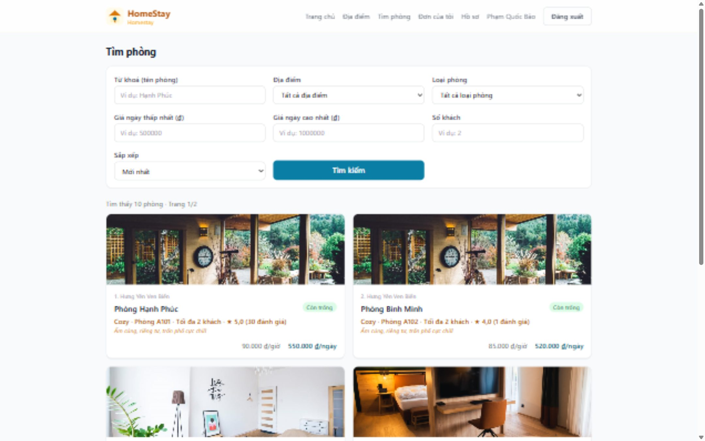

Từ menu "Tìm phòng", khách lọc danh sách phòng theo 6 tiêu chí: từ khoá, cơ sở, loại
phòng (Concept / Cozy / Japandi / Signature), khoảng giá theo ngày, số khách tối đa và
cách sắp xếp. Kết quả hiển thị dạng lưới, mỗi thẻ phòng cho biết tên, số phòng, cơ sở,
số khách, các tiện nghi nổi bật, giá theo giờ và theo ngày.

**Các quy tắc nghiệp vụ đã áp dụng:**

- Giá hiển thị theo định dạng `90.000 ₫/giờ` và `550.000 ₫/ngày` (dấu chấm phân cách nghìn theo chuẩn Việt Nam).
- Lọc theo từ khoá tìm trong tên phòng, số phòng và mô tả.
- Lọc giá và số khách được kiểm tra ở **tầng nghiệp vụ** (`RoomService`), không chỉ ở giao diện.
- Danh sách **phân trang**, mỗi trang 9 phòng; kết quả rỗng hiển thị trạng thái Empty
  kèm nút xoá bộ lọc, không hiển thị trang trắng.
- Sắp xếp theo giá tăng, giá giảm, đánh giá tốt nhất và mới nhất.
- Số thứ tự (STT) do giao diện tự tính, không lấy từ cơ sở dữ liệu.

### 4.1.3. Chi tiết phòng

*Hình 4.4. Trang chi tiết phòng*

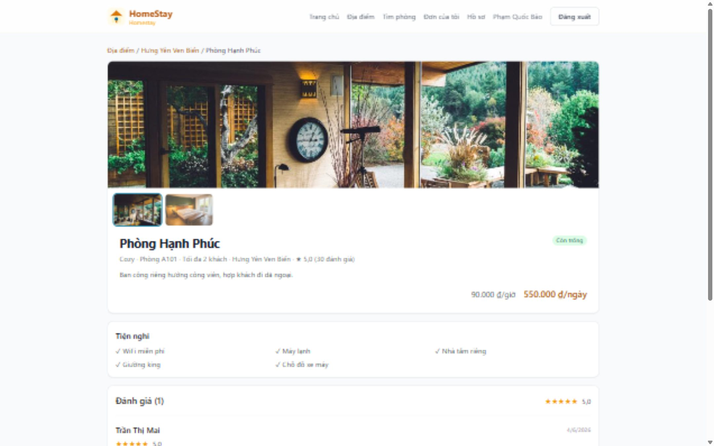

Trang chi tiết hiển thị ảnh phòng (ảnh đầu tiên là ảnh chính), mô tả, tiện nghi đầy đủ,
giá theo giờ và theo ngày, điểm đánh giá trung bình kèm số lượt đánh giá, và các nhận
xét của khách trước. Ngay trên trang là khung chọn khoảng thời gian, cho phép khách
chọn đặt **theo giờ** hoặc **theo ngày** trước khi chuyển sang bước xác nhận.

**Các quy tắc nghiệp vụ đã áp dụng:**

- Giờ nhận phòng tiêu chuẩn 14:00, giờ trả phòng tiêu chuẩn 12:00.
- Khung thời gian chỉ cho chọn trong tương lai và phải đủ xa thời điểm hiện tại.
- Trường hợp chưa có đánh giá nào, trang hiển thị "Chưa có đánh giá" thay vì để trống.
- Trường hợp phòng đã có đơn trong khoảng đang chọn, khung chọn thời gian báo rõ và
  chuyển sang bước xác nhận với thông báo không thể đặt.

### 4.1.4. Kiểm tra phòng trống

*Hình 4.5. Kiểm tra phòng trống — phòng A201 đã có đơn trong khung 29/10 15:00 → 19:00*

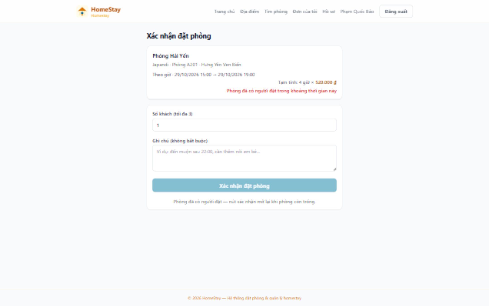

Đây là bước chống đặt trùng lịch. Khi khách chọn khoảng thời gian, hệ thống gọi API
kiểm tra phòng trống và hiển thị ngay kết quả **trước khi** khách điền form. Trong hình,
phòng A201 đang có đơn `HS-261029-0015` ở trạng thái "Đang ở" trong đúng khung giờ đó, nên
hệ thống trả về *"Phòng đã có người đặt trong khoảng thời gian này"* và **khoá luôn nút
xác nhận**.

**Thuật toán chống trùng lịch — công thức so sánh khoảng thời gian chồng lấn:**

Hai khoảng `[c₁, t₁]` và `[c₂, t₂]` chồng lấn nhau khi và chỉ khi:

```
c₁ < t₂  VÀ  t₁ > c₂
```

Tức là một đơn mới bị từ chối khi thời điểm nhận phòng của đơn mới **trước** thời điểm
trả phòng của đơn cũ, đồng thời thời điểm trả phòng của đơn mới **sau** thời điểm nhận
phòng của đơn cũ. Phép so sánh dùng `<` và `>` chứ không dùng `<=` và `>=`: khách trả phòng
lúc 12:00 thì khách mới được nhận phòng lúc 12:00, hai khoảng chạm biên không tính là
trùng nhau.

Công thức này được cài đặt ở **3 tầng độc lập** để không thể bị vòng qua:

1. **Tầng giao diện** — kiểm tra trước khi hiển thị nút xác nhận (hình 4.5).
2. **Tầng nghiệp vụ** — `BookingService.KiemTraTrongAsync`, chạy trong transaction.
3. **Tầng cơ sở dữ liệu** — khóa tường `EXISTS` trên `Bookings` và transaction `REPEATABLE READ`
   của InnoDB, chặn cả trường hợp hai request đến đồng thời.

Chỉ những đơn ở trạng thái `PENDING`, `CONFIRMED`, `CHECKED_IN` mới chiếm chỗ; đơn đã
`CANCELLED`, `REJECTED`, `COMPLETED` được giải phóng để phòng đặt lại được.

**Các quy tắc nghiệp vụ đã áp dụng:**

- Đặt **theo giờ** tối thiểu 3 giờ.
- Đặt trước thời điểm hiện tại tối thiểu 2 giờ, kiểm tra bằng giờ của **server** chứ không
  tin giờ trình duyệt gửi lên.
- Trả phòng phải sau nhận phòng.
- Giá trị `type` ngoài khoảng `0` (theo giờ) và `1` (theo ngày) trả về `400`.
- Thiếu mốc thời gian trả về `400` — tham số sai là lỗi, còn phòng hết chỗ là kết quả
  hợp lệ với `isAvailable = false`.

### 4.1.5. Đặt phòng theo giờ và theo ngày

*Hình 4.6. Xác nhận đặt phòng theo giờ*

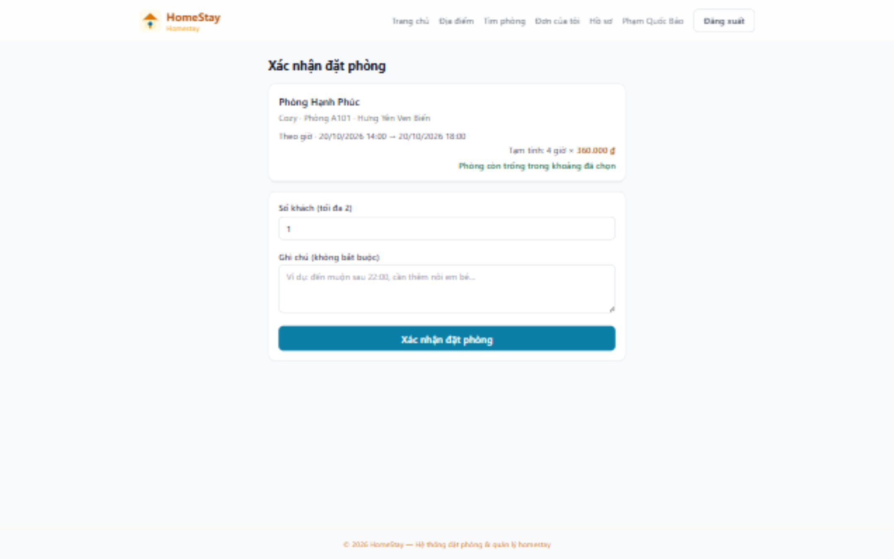

*Hình 4.7. Xác nhận đặt phòng theo ngày*


Khách xác nhận đặt phòng bằng cách điền số khách và ghi chú (không bắt buộc). Giao diện
hiển thị **tạm tính** ngay trên trang, để khách biết trước số tiền.

**Công thức tính tiền:**

| Cách thuê | Công thức | Ví dụ |
|-----------|-----------|-------|
| Theo giờ | `số giờ (làm tròn LÊN) × đơn giá 1 giờ` | 4 giờ × 130.000 ₫ = 520.000 ₫ |
| Theo ngày | `số ngày (làm tròn LÊN) × đơn giá 1 ngày` | 2 ngày × 550.000 ₫ = 1.100.000 ₫ |

Vì sao làm tròn **lên** nhỏ nhất: khách đặt 4 giờ 1 phút vẫn phải trả 5 giờ — thuê được
thêm 1 phút không có ý nghĩa với đơn vị sản phẩm là giờ và ngày. Nếu làm tròn xuống,
hệ thống sẽ phải xử lý trường hợp đặt 2 giờ 59 phút cũng tính tiền 3 giờ nhưng mất phần
phút đã dùng. Công thức được viết một lần ở `BookingCalculator` phía backend và một lần
ở `pricing.ts` phía frontend; cùng một bộ test ở cả hai nơi để bảo đảm không lệch.

**Các quy tắc nghiệp vụ đã áp dụng:**

- Số khách không được vượt sức chứa của phòng.
- Cùng một tài khoản không được có hai đơn trùng khung giờ trên cùng một phòng.
- Mỗi lần đặt sinh mã đơn dạng `HS-YYMMDD-XXXX` (ví dụ `HS-261029-0015`) để khách tra
  cứu bằng mã thay vì bằng khóa nội bộ của cơ sở dữ liệu.
- Đơn mới có trạng thái `PENDING`, đồng thời đổi trạng thái phòng thành `BOOKED`.
- Toàn bộ thao tác tạo đơn + đổi trạng thái phòng + ghi lịch sử nằm trong **một transaction**.
- Nếu phần nào thất bại, transaction hoàn tác, không để lại đơn mồ côi.

### 4.1.6. Quản lý đơn của tôi và hủy đơn

*Hình 4.8. Danh sách đơn của khách, có lọc theo trạng thái*

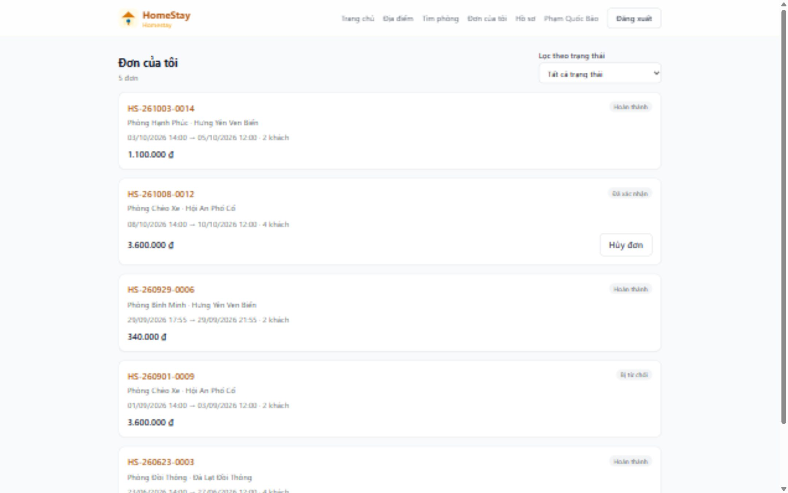

Khách xem toàn bộ đơn của mình, lọc theo 6 trạng thái (Chờ xác nhận, Đã xác nhận, Đang ở,
Hoàn thành, Đã hủy, Bị từ chối), tìm theo mã đơn. Mỗi đơn hiển thị mã đơn, phòng, cơ sở,
khoảng thời gian, số khách và tổng tiền. Nút "Hủy đơn" chỉ xuất hiện với đơn `PENDING`.

**Các quy tắc nghiệp vụ đã áp dụng:**

- Khách chỉ xem được đơn của chính mình; xem đơn của người khác trả về `404` (không tiết lộ
  rằng đơn đó tồn tại).
- Hủy đơn chỉ áp dụng cho `PENDING`. Hủy lần thứ hai trả `409`.
- Hủy đơn giải phóng phòng: trạng thái phòng trở lại `AVAILABLE`.
- Mọi thay đổi trạng thái đều được ghi vào bảng lịch sử kèm người thực hiện và thời điểm.

### 4.1.7. Đánh giá và nhận xét

*Hình 4.9. Chi tiết đơn hoàn thành kèm lịch sử trạng thái và biểu mẫu đánh giá*

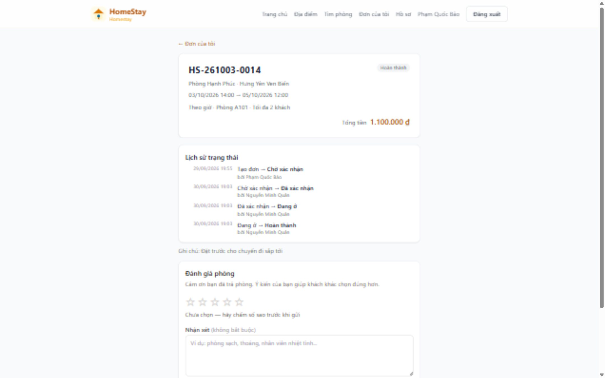

Trang chi tiết đơn hiển thị đầy đủ lịch sử 4 bước xử lý và biểu mẫu đánh giá gồm **thang
điểm 5 sao** và ô nhận xét. Hình 4.9 thuộc đơn `HS-261003-0014` của khách Phạm Quốc Bảo:
bước "Tạo đơn" ghi tên **khách tạo đơn**, ba bước sau ghi tên **quản trị viên** đã xử lý —
đúng như nguyên tắc lưu vết ai làm gì.

**Các quy tắc nghiệp vụ đã áp dụng:**

- Chỉ đánh giá được đơn có trạng thái `COMPLETED`; các trạng thái khác không hiện biểu mẫu.
- Mỗi đơn chỉ có **1 đánh giá**; đánh giá lần hai trả `409`.
- Điểm đánh giá nằm trong khoảng 1–5, nhận xét tối đa 1000 ký tự.
- Điểm trung bình của phòng được tính lại mỗi khi có đánh giá mới.
- Đánh giá của phòng chỉ hiện trên trang công khai sau khi quản trị viên duyệt.

### 4.1.8. Thanh toán

*Hình 4.18. Danh sách phiếu thu của khách kèm khối chọn phương thức thanh toán*

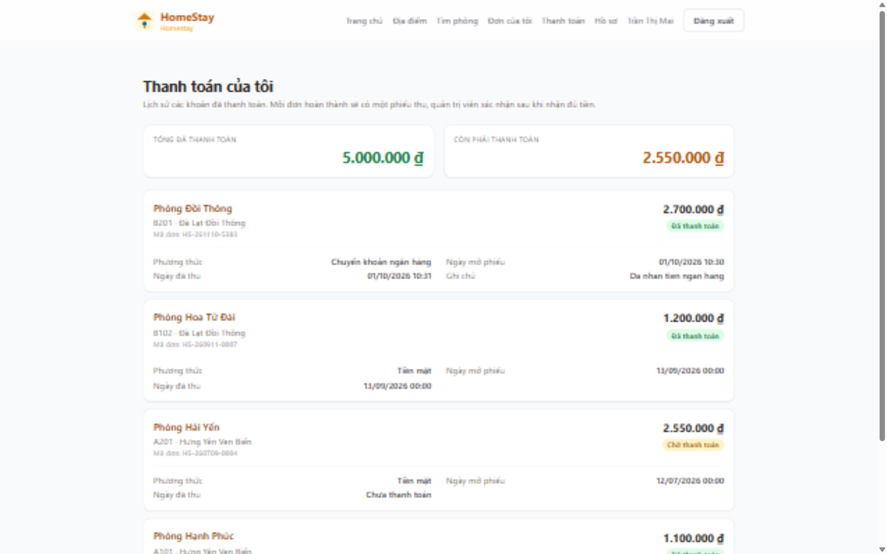

Phiếu thu được **mở tự động khi đơn chuyển sang trạng thái `COMPLETED`** (khách đã trả
phòng), chứ không mở lúc khách đặt. Khách vào trang "Thanh toán" xem được toàn bộ phiếu
thu của mình và chọn phương thức thanh toán mong muốn.

**Các quy tắc nghiệp vụ đã áp dụng:**

- Chỉ chọn được phương thức thanh toán cho phiếu thu thuộc đơn đã `COMPLETED` và thuộc đúng
  khách đang đăng nhập; chọn của người khác trả `404`.
- Mỗi đơn có **đúng 1 phiếu thu** — ràng buộc `UNIQUE` trên `Payments.BookingId`, không thể
  sinh ra 2 phiếu cho cùng một đơn.
- Đơn chưa trả phòng thì không có phiếu thu để chọn, giao diện hiển thị thông báo rõ ràng.
- Số tiền lấy nguyên từ tổng tiền của đơn (`Bookings.TotalAmount`), khách không tự nhập.

**Ranh giới của tính năng:** hệ thống **ghi nhận phương thức thanh toán và đối chiếu số
tiền**, chưa nối với cổng thanh toán trực tuyến (VNPay, MoMo) vì việc đó nằm ngoài phạm vi
đồ án. Quản trị viên là người xác nhận "đã thu tiền" — đây là bước mô phỏng bước webhook
cổng thanh toán trả về.

### 4.1.9. Thông báo trong hệ thống

*Hình 4.19. Trang thông báo của khách, phần thông báo chưa đọc được tô đậm*

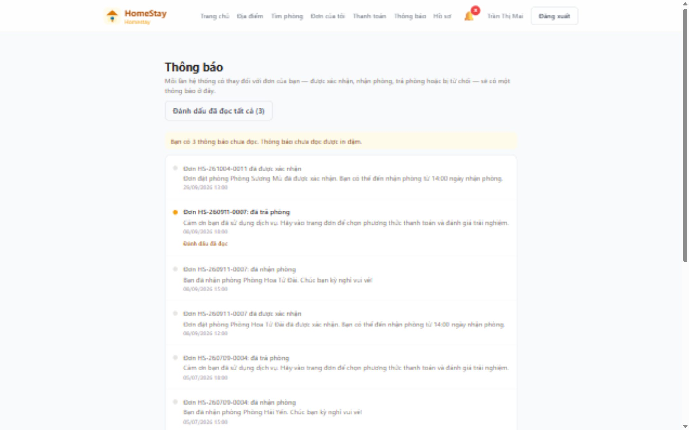

Mỗi khi quản trị viên chuyển trạng thái đơn, hệ thống **tự sinh thông báo** gửi cho khách.
Thông báo hiển thị ngay trong hệ thống qua biểu tượng chuông ở góc phải thanh điều hướng,
có con số đếm số thông báo chưa đọc.

*Hình 4.20. Trạng thái sau khi bấm chuông: đã đánh dấu đọc và mở danh sách thông báo*

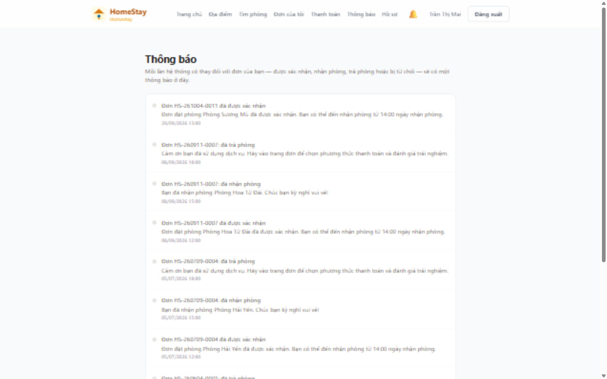

*Hình 4.21. Thông báo do hệ thống sinh ra khi quản trị viên xác nhận đơn*

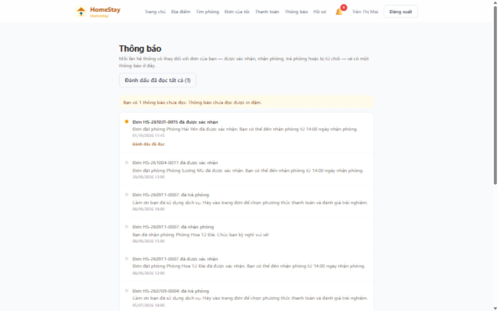

**Các quy tắc nghiệp vụ đã áp dụng:**

- Thông báo được sinh **trong cùng một transaction** với thao tác đổi trạng thái đơn. Nếu
  ghi thông báo thất bại thì cả thao tác đổi trạng thái cũng hoàn tác — không có chuyện đơn
  đã đổi trạng thái nhưng khách không nhận được thông báo.
- Chỉ gửi thông báo cho những chuyển trạng thái **khách quan trọng**: `CONFIRMED`,
  `REJECTED`, `CHECKED_IN`, `COMPLETED`, `CANCELLED`.
- Bấm chuông sang thẳng trang `/notifications` và đánh dấu các thông báo mới nhất là đã đọc
  ngay trên API, không cần bấm từng thông báo.
- Thông báo đã đọc thì **không hiện** nút "Đánh dấu đã đọc" — tránh thao tác vô nghĩa.
- Khách xem thông báo của người khác trả `404`, không trả `403`: trả `403` sẽ lộ ra sự tồn
  tại của dữ liệu không thuộc về mình.

**Ranh giới của tính năng:** thông báo chỉ hiển thị **trong hệ thống**, chưa gửi qua email
hoặc tin nhắn SMS. Nguyên nhân là hai kênh đó cần tài khoản dịch vụ bên thứ ba, cấu hình
mật khẩu ứng dụng và cơ chế chống gửi trùng — nằm ngoài phạm vi đồ án.

---

## 4.2. TRIỂN KHAI CÁC CHỨC NĂNG CHO QUẢN TRỊ VIÊN

Quản trị viên đăng nhập bằng tài khoản riêng và truy cập khu vực `/admin` với 7 trang:
Thống kê, Đơn đặt phòng, Cơ sở, Tiện nghi, Đánh giá, Phòng, Khách hàng, Thanh toán.
Mọi trang đều được bảo vệ
ở **cả hai tầng**: attribute `[Authorize(Roles = "ADMIN")]` ở API và `ProtectedRoute`
ở giao diện — gọi thẳng URL cũng bị chặn.

### 4.2.1. Dashboard thống kê

*Hình 4.10. Trang thống kê tổng quan*

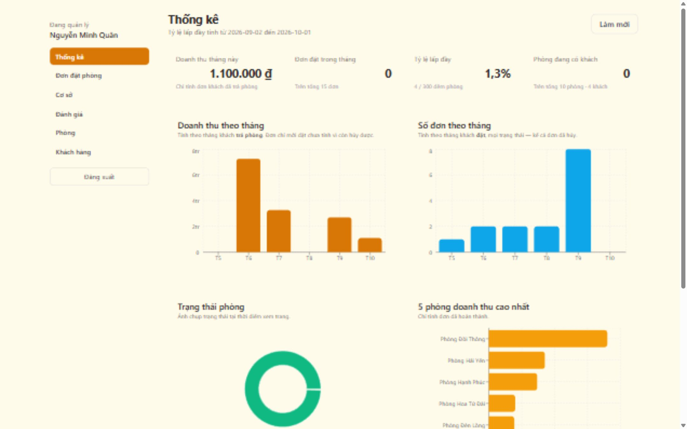

Trang thống kê tổng hợp 4 chỉ số (doanh thu tháng này, đơn đặt trong tháng, tỷ lệ lấp
đầy, số phòng đang có khách) và 4 biểu đồ: doanh thu theo tháng, số đơn theo tháng,
trạng thái phòng, 5 phòng doanh thu cao nhất. Có nút "Làm mới" để lấy số liệu mới nhất.

**Các quy tắc nghiệp vụ đã áp dụng:**

- Mốc thời gian thống kê do người dùng chọn, mặc định là từ đầu tháng trước đến ngày hôm nay.
- Doanh thu chỉ tính đơn đã hoàn thành và đang ở — đơn chờ xác nhận hoặc bị từ chối không
  phải doanh thu thật được.
- Tỷ lệ lấp đầy = số đêm đã bán ÷ (số phòng × số đêm trong khoảng), làm tròn 1 chữ số thập phân.
- Số phòng đang có khách không cộng các phòng đang vệ sinh hoặc bảo trì.
- Biểu đồ vẽ bằng Recharts, không nhúng ảnh tĩnh, nên số liệu luôn khớp với dữ liệu hiện tại.

### 4.2.2. Quản lý cơ sở (địa điểm)

*Hình 4.11. Quản lý cơ sở homestay*

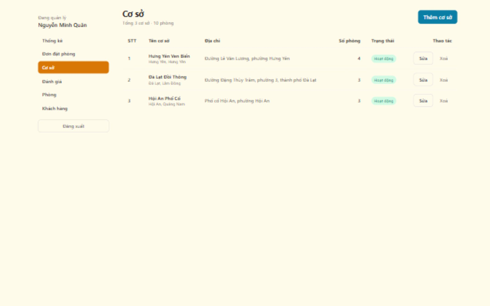

Quản trị viên thêm, sửa và xoá cơ sở homestay. Mỗi cơ sở gồm tên, địa chỉ, số điện
thoại, mô tả và danh sách phòng thuộc cơ sở.

**Các quy tắc nghiệp vụ đã áp dụng:**

- Tên cơ sở không được trùng với cơ sở đã có.
- Không xoá được cơ sở đang còn phòng — phải xử lý phòng trước, tránh mất dữ liệu đơn cũ.
- Cơ sở không có phòng vẫn hiển thị ở bộ lọc tìm phòng, nhưng kết quả trả về rỗng kèm
  trạng thái Empty thay vì lỗi.

### 4.2.3. Quản lý phòng, ảnh và tiện nghi

*Hình 4.12. Danh sách phòng*


*Hình 4.13. Biểu mẫu thêm / sửa phòng, gồm ảnh và tiện nghi*

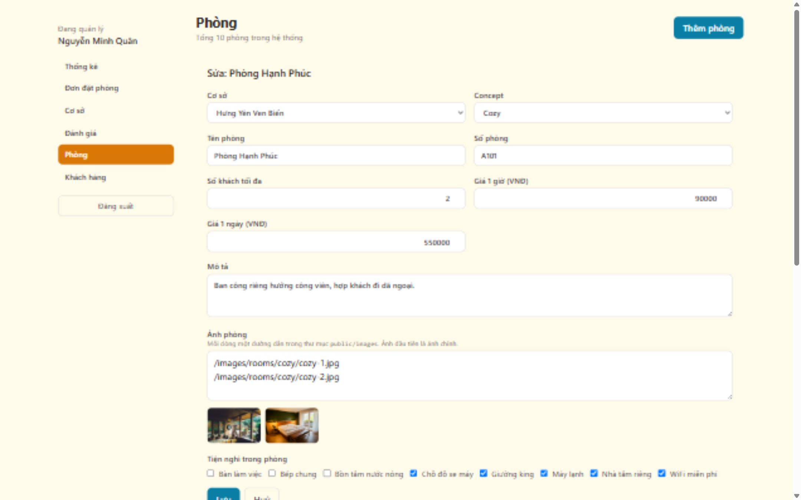

Quản trị viên quản lý toàn bộ thông tin phòng: cơ sở, concept, tên, số phòng, số khách
tối đa, giá theo giờ, giá theo ngày, mô tả, danh sách ảnh và tiện nghi. Bảng danh sách
hiển thị STT tự tính, giá căn phải, trạng thái phòng có nút chuyển màu.

**Các quy tắc nghiệp vụ đã áp dụng:**

- Số phòng phải duy nhất trong toàn hệ thống (ví dụ `A101` không được lặp).
- Số khách tối đa phải từ 1 đến 20; giá phải lớn hơn 0.
- Giá theo ngày phải lớn hơn giá theo giờ nhân 6 — nếu không, thuê theo ngày lúc nào
  cũng lỗi về mặt kinh tế.
- Ảnh nhập mỗi dòng một đường dẫn trong thư mục `public/images`; ảnh đầu tiên là ảnh chính.
- Tiện nghi dùng bảng nối nhiều-nhiều `RoomAmenities`, không lưu danh sách dạng chuỗi.
- Không xoá được phòng đang có đơn chưa hoàn thành.

### 4.2.4. Quản lý vòng đời đơn đặt phòng

*Hình 4.14. Danh sách đơn đặt phòng phía quản trị*

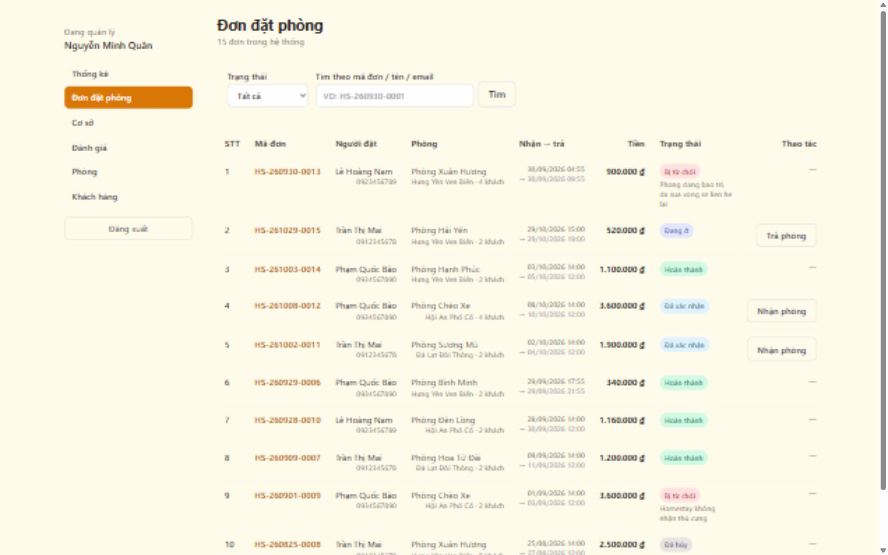

*Hình 4.15. Các nút thao tác theo trạng thái đơn: Xác nhận / Từ chối / Nhận phòng / Trả phòng*

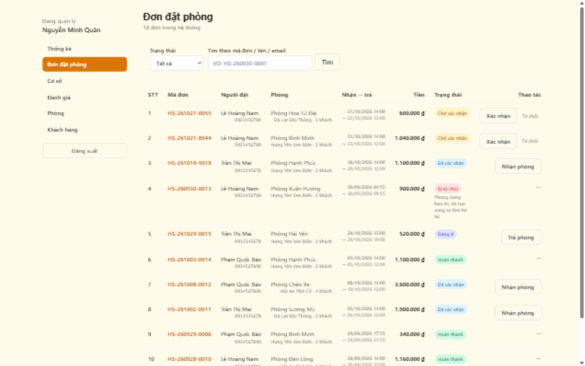

Đây là màn hình vận hành chính của quản trị viên. Mỗi hàng hiển thị đúng một bộ nút tương
ứng với trạng thái hiện tại của đơn, nhờ đó người dùng không thể bấm nhầm thao tác không
hợp lệ. Khi từ chối, hệ thống bắt buộc nhập lý do, lý do này hiển thị cho khách.

**Ma trận chuyển trạng thái (chỉ các chuyển tiếp hợp lệ):**

| Từ \ Sang | `PENDING` | `CONFIRMED` | `CHECKED_IN` | `COMPLETED` | `CANCELLED` | `REJECTED` |
|-----------|:---------:|:-----------:|:------------:|:-----------:|:----------:|:---------:|
| **`PENDING`** | — | ✔ | ✘ | ✘ | ✔ | ✔ |
| **`CONFIRMED`** | ✘ | — | ✔ | ✘ | ✔ | ✘ |
| **`CHECKED_IN`** | ✘ | ✘ | — | ✔ | ✘ | ✘ |
| **`COMPLETED`** | ✘ | ✘ | ✘ | — | ✘ | ✘ |
| **`CANCELLED`** | ✘ | ✘ | ✘ | ✘ | — | ✘ |
| **`REJECTED`** | ✘ | ✘ | ✘ | ✘ | ✘ | — |

✔ = chuyển trạng thái hợp lệ · ✘ = trả về `409 Conflict`

**Các quy tắc nghiệp vụ đã áp dụng:**

- Mỗi lần chuyển trạng thái ghi 1 dòng vào `BookingStatusHistory`, kèm người thực hiện và thời điểm.
- `CONFIRMED` → `CHECKED_IN` đổi trạng thái phòng sang `OCCUPIED`.
- `CHECKED_IN` → `COMPLETED` đổi phòng sang `CLEANING`; sau 2 giờ một tác vụ nền tự đưa
  phòng về `AVAILABLE` mà không cần thao tác tay.
- Thao tác lặp lại cùng một trạng thái trả `409`, không phải `200` — tránh việc ghi
  trùng lịch sử.
- `COMPLETED`, `CANCELLED`, `REJECTED` là trạng thái kết thúc, không thể chuyển tiếp.
- Khách tự hủy được đơn `PENDING`; các trạng thái khác do quản trị viên xử lý.

### 4.2.5. Quản lý khách hàng

*Hình 4.16. Danh lịch khách hàng*

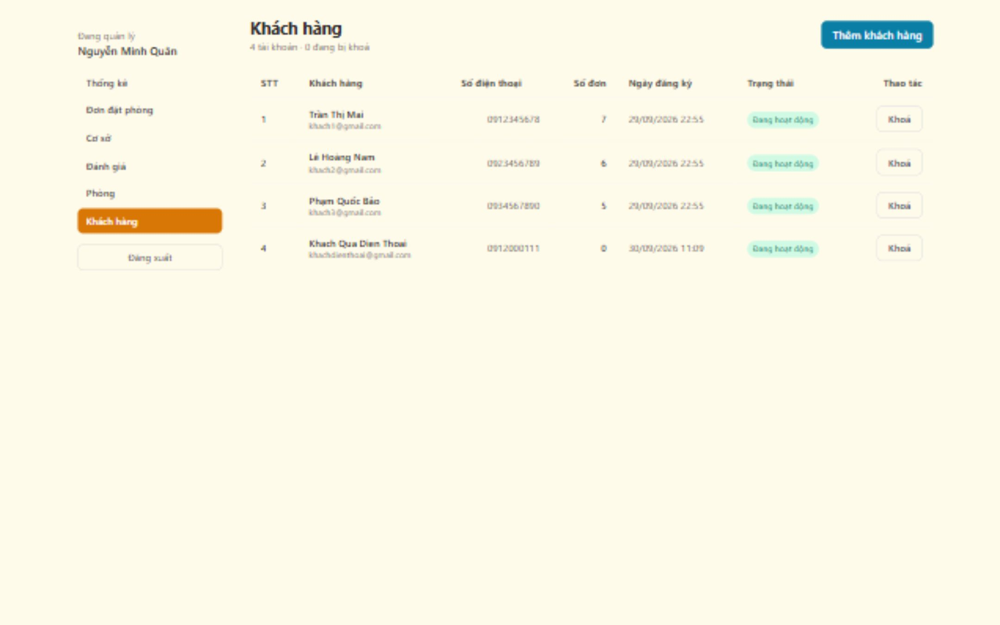

Quản trị viên xem danh sách khách hàng kèm số đơn và tổng chi tiêu của từng tài khoản,
tìm theo tên / email / số điện thoại, và **khoá** tài khoản khi có hành vi không hợp lệ.

**Các quy tắc nghiệp vụ đã áp dụng:**

- Khoá tài khoản khiến tài khoản đó đăng nhập lại không được, nhưng **dữ liệu đơn vẫn giữ nguyên**.
- Tài khoản đang có đơn `PENDING` hoặc `CHECKED_IN` sẽ bị chặn khoá và hệ thống báo rõ lý do.
- Mật khẩu trong bảng người dùng ở dạng BCrypt hash, không API nào trả về trường này.
- Quản trị viên không xem được hồ sơ của chính mình trong danh sách này.

### 4.2.6. Quản lý đánh giá

*Hình 4.17. Quản lý đánh giá và nhận xét của khách*

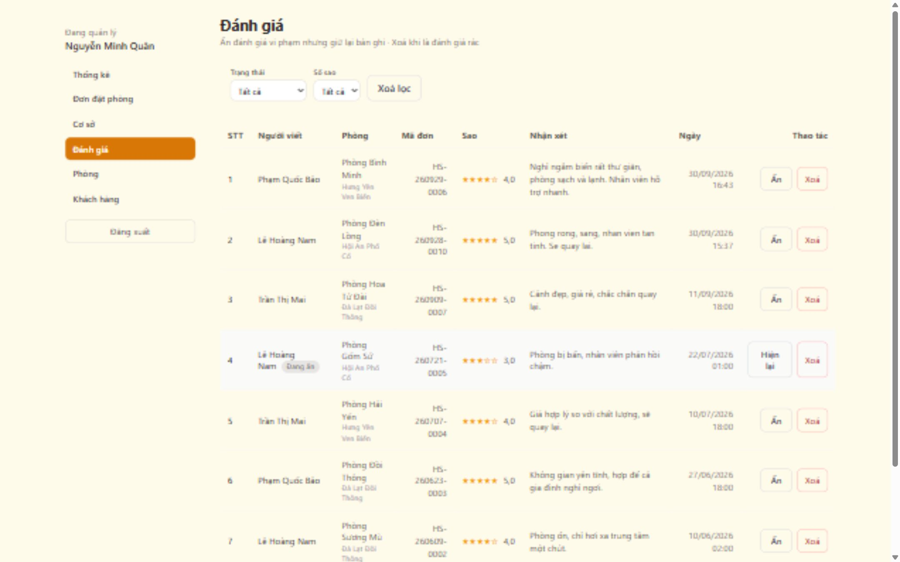

Quản trị viên lọc đánh giá theo trạng thái duyệt và theo số sao, đọc nhận xét của khách,
và quyết định **ẩn** đánh giá không phù hợp. Đánh giá đã ẩn không hiện trên trang công khai.

**Các quy tắc nghiệp vụ đã áp dụng:**

- Đánh giá mới mặc định chờ duyệt, không hiện công khai ngay.
- Thao tác ẩn/hiện lại ghi lại thời điểm để truy vết.
- Xoá đánh giá cần xác nhận lần hai, tránh xoá nhầm.

### 4.2.7. Quản lý thanh toán

*Hình 4.22. Bảng phiếu thu phía quản trị viên, lọc theo trạng thái và phân trang*

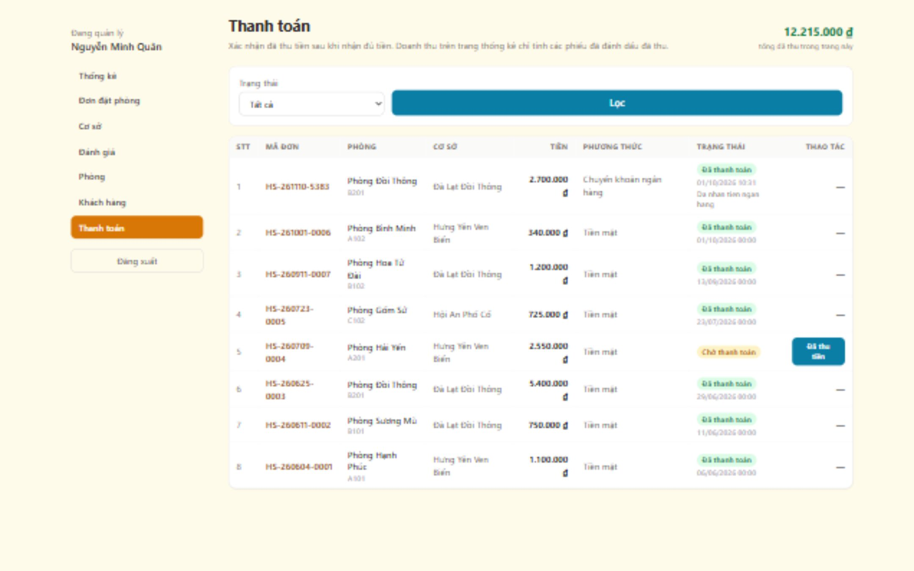

*Hình 4.23. Khối thống kê phiếu thu mở để quản trị viên đối chiếu số tiền với tổng tiền của đơn*

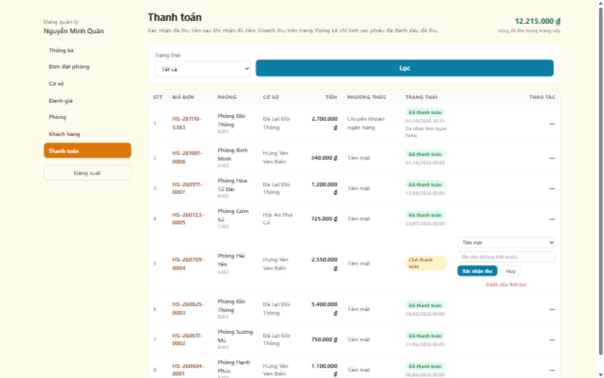

Phiếu thu được mở tự động khi quản trị viên bấm "Trả phòng" (đơn chuyển `COMPLETED`),
với phương thức mặc định là tiền mặt và trạng thái `CHỜ THU`. Quản trị viên đối chiếu số
tiền với tổng tiền của đơn rồi xác nhận **"Đã thu tiền"**.

**Các quy tắc nghiệp vụ đã áp dụng:**

- Hệ thống **đối chiếu số tiền phiếu thu với `Bookings.TotalAmount`** của đơn. Lệch thì
  trả `400` và **không** ghi nhận đã thu — chặn trường hợp bấm nhầm làm sai sổ.
- Doanh thu trên Dashboard lấy từ các phiếu thu có trạng thái `ĐÃ THU`, **không** lấy từ
  tổng tiền của đơn. Lý do: đơn đã trả phòng nhưng chưa thu tiền thì chưa phải doanh thu.
  Trường hợp khách báo đã chuyển khoản nhưng tiền chưa về được ghi nhận trạng thái `THẤT BẠI`
  để không tính nhầm vào doanh thu.
- Không thể đánh dấu đã thu một phiếu đã `ĐÃ THU` — trả `409`.
- Bộ lọc danh sách hỗ trợ cả trạng thái lẫn phương thức thanh toán, có phân trang.

---

## 4.3. KIỂM THỬ VÀ TRIỂN KHAI ỨNG DỤNG

### 4.3.1. Kiểm thử hệ thống

Hệ thống được kiểm thử ở **4 mức độ**, mỗi mức bắt được nhóm lỗi khác nhau.

#### 4.3.1.1. Tổng quan

**Bảng 4.1. Tổng hợp các mức kiểm thử**

| Mức | Công cụ | Số lượng | Kết quả |
|-----|---------|----------|---------|
| Kiểm thử đơn vị — backend | xUnit + EF Core InMemory | **414 test** | 414 pass |
| Kiểm thử đơn vị — frontend | Vitest + Testing Library | **287 test** | 287 pass |
| Kiểm thử tích hợp REST API | Postman collection (41 request, 115 kiểm chứng) | 41 request | 41/41 pass |
| Kiểm thử tay trên trình duyệt | Bảng kịch bản tự lập | **267 kịch bản** | 267/267 đạt |

`dotnet build` và `npm run build` đều hoàn tất với **0 lỗi, 0 cảnh báo**.

#### 4.3.1.2. Kiểm thử tích hợp bằng Postman

Collection `docs/api/postman_collection.json` gồm **41 request chia 7 nhóm**, mỗi request
kèm các kiểm chứng (assertion) về mã trạng thái và nội dung trả về. Ba test trọng tâm
kiểm tra khả năng chống đặt trùng:

**Bảng 4.2. Ba test chống đặt trùng**

| Mã | Cách phát hiện | Kỳ vọng | Thực tế | Kết quả |
|----|---------------|---------|---------|---------|
| **T1** | Cùng một khách đặt lại đúng khung giờ | `409` | HTTP 409 *"Phòng đã có người đặt trong khoảng thời gian này"* | **Đạt** |
| **T2** | Khách thứ hai đặt khung giờ đang có người đặt | `409` | HTTP 409 | **Đạt** |
| **T3** | Hai request gửi **song song** cùng phòng + cùng khung giờ | Đúng 1 đơn tạo (201), 1 đơn bị từ chối (409) | `[201, 409]` | **Đạt** *(sau khi sửa)* |

**Bảng 4.3. 18 test case tiêu biểu**

| STT | Mục đích | Input / thao tác | Kỳ vọng | Thực tế | Kết quả |
|-----|----------|------------------|---------|---------|---------|
| 1 | Xác thực khách hàng | `POST /api/auth/login` với tài khoản khách đúng | `200`, trả access token + refresh token | đúng mã, đúng 3 trường | Đạt |
| 2 | Xác thực quản trị | `POST /api/auth/login` với tài khoản Admin | `200`, `role = ADMIN` | đúng | Đạt |
| 3 | Sai mật khẩu | `POST /api/auth/login` sai mật khẩu | `401` | HTTP 401 | Đạt |
| 4 | Tra cứu địa điểm | `GET /api/locations` | `200`, 3 cơ sở kèm số phòng | đúng | Đạt |
| 5 | Tìm phòng | `GET /api/rooms/search` có điều kiện lọc | `200`, danh sách phân trang đúng | đúng | Đạt |
| 6 | Tham số vô lý | `GET /api/rooms/search?soNgay=9999` | `400` | HTTP 400 | Đạt |
| 7 | Thiếu tham số bắt buộc | `GET /api/rooms/availability` không có mốc thời gian | `400` | HTTP 400 | Đạt |
| 8 | Tạo đơn hợp lệ | `POST /api/bookings` khung giờ trống | `201`, mã `HS-…`, trạng thái `PENDING` | đúng | Đạt |
| 9 | **Chống trùng — cùng khách** | T1: đặt lại đúng khung giờ vừa tạo | `409` | HTTP 409 | Đạt |
| 10 | **Chống trùng — khách khác** | T2: khách thứ hai đặt khung giờ đó | `409` | HTTP 409 | Đạt |
| 11 | **Chống trùng — song song** | T3: 2 request gửi đồng thời | `[201, 409]` | `[201, 409]` | Đạt *(sau khi sửa)* |
| 12 | Đặt vượt sức chứa | Số khách vượt số khách tối đa của phòng | `400` | HTTP 400 | Đạt |
| 13 | Lọc đơn theo trạng thái | `GET /api/bookings?status=PENDING` | `200`, chỉ trả đơn `PENDING` | đúng | Đạt |
| 14 | Chặn đọc dữ liệu người khác | Khách xem đơn không thuộc về mình | `404` | HTTP 404 | Đạt |
| 15 | Chuyển trạng thái hợp lệ | Admin xác nhận đơn `PENDING` | `200`, sang `CONFIRMED`, ghi lịch sử | đúng | Đạt |
| 16 | Chuyển trạng thái không hợp lệ | Admin hủy đơn đang `CHECKED_IN` | `409` | HTTP 409 | Đạt |
| 17 | Phân quyền | Khách gọi API của Admin | `403` | HTTP 403 | Đạt |
| 18 | Đánh giá trùng | Đánh giá lần 2 cùng một đơn | `409` | HTTP 409 | Đạt |

**Bảng 4.4. Cơ cấu 7 nhóm kiểm thử tích hợp**

| Nhóm | Số request | Nội dung |
|------|-----------:|----------|
| 01 — Xác thực | 4 | Đăng nhập khách / khách thứ hai / Admin, sai mật khẩu → 401 |
| 02 — Chuẩn bị dữ liệu | 5 | Đưa 4 phòng về `AVAILABLE` để chạy lại nhiều lần |
| 03 — Tra cứu công khai | 4 | Địa điểm, tìm phòng, tham số vô lý → 400, thiếu tham số → 400 |
| 04 — Chống đặt trùng | 8 | Tạo đơn, T1, T2, T3a, T3b, vượt sức chứa → 400, dọn dẹp |
| 05 — Đơn của tôi | 7 | Danh sách, lọc trạng thái, `status` ngoài enum, chi tiết + lịch sử, đơn người khác → 404, hủy, hủy lần 2 → 409 |
| 06 — Vòng đời đơn (Admin) | 8 | Tạo → xác nhận → xác nhận lại 409 → check-in → hủy khi đang ở 409 → check-out → lịch sử 4 bước |
| 07 — Phân quyền, thống kê, đánh giá | 5 | Khách gọi API Admin → 403, không token → 401, dashboard, đánh giá 201, đánh giá lần 2 → 409 |
| **Tổng** | **41** | **115 kiểm chứng, chạy liên tiếp 12/12 lần đều đạt** |

#### 4.3.1.3. Ba lỗi thật phát hiện trong quá trình kiểm thử

Kiểm thử không chỉ để chứng minh hệ thống chạy đúng, mà còn phát hiện 3 lỗi thật.
Cả 3 lỗi đều đã sửa và có test chặn lại để không tái diễn.

**Lỗi 1 — Đặt trùng trả `500` thay vì `409` khi có hai request đến đồng thời (mức CSDL)**

Khi test T3 gửi hai request đặt phòng thật sự song song, một đơn được tạo thành công
nhưng đơn còn lại trả về `500 Internal Server Error` thay vì `409 Conflict`. Nguyên nhân:
hai transaction InnoDB tranh nhau khoá cùng một dòng, MySQL trả về mã lỗi `1213`
(deadlock) hoặc `1205` (lock wait timeout), nhưng code chỉ bắt `InvalidOperationException`
nên lỗi bị bọc lại thành `500` — trong khi người dùng chỉ cần biết "phòng đã có người đặt".

Cách sửa: dò **cả chuỗi exception** (`DbUpdateException` → `MySqlException`) và đọc
`MySqlException.Number` thay vì `ErrorCode` (vì `ErrorCode` của MySqlConnector trả về
HResult chứ không phải mã lỗi, nên cách đọc sai ban đầu không bắt được gì), sau đó chuyển
đúng 3 mã lỗi tranh chấp thành `409`. Các lỗi còn lại vẫn giữ `500` để không che giấu
sự cố hệ thống.

**Lỗi 2 — Trang `/swagger` không hiển thị**

Sau khi bỏ gói thừa theo yêu cầu cài đặt phiên bản ghim, thư viện Swagger kéo theo phiên
bản `Microsoft.OpenApi` mới hơn, phát ra tài liệu `openapi: 3.0.4`. Swagger UI mặc định
chỉ hỗ trợ `3.0.x` nên trang trắng. Cách sửa: khai báo tường minh `SwaggerDoc` với đúng
phiên bản `3.0.1` mà UI hỗ trợ.

**Lỗi 3 — Gửi sai mốc giờ làm hỏng cơ chế chống đặt trùng (mức giao diện)**

Đây là lỗi nguy hiểm nhất và chỉ lộ ra khi chụp ảnh phục vụ báo cáo. Giao diện dùng
`toISOString()` để gửi mốc giờ lên API. Hàm này trả về giờ **UTC** kèm chữ `Z`, trong
khi máy chủ đang ở múi giờ UTC+7 và hệ thống quy ước mọi mốc giờ là **giờ địa phương**
(dữ liệu mẫu nhận phòng 14:00, trả phòng 12:00). Hệ quả: khách chọn khung 15:00–19:00,
giao diện hiển thị đúng *"15:00 → 19:00"*, nhưng hệ thống nhận và lưu là 08:00–12:00 — lệch
7 giờ. Phòng **đã có người đặt** đúng khung 15:00–19:00 nhưng hệ thống không nhận ra trùng
và vẫn tạo đơn. Đây đúng là loại lỗi mà giao diện nhìn không có gì sai nhưng dữ liệu thì sai.

Cách sửa: thêm hàm `toLocalIsoString()` định dạng mốc giờ theo giờ địa phương, không gắn
ký `Z`, và dùng ở cả 3 chỗ gửi lên API. Hàm này có 4 test riêng, trong đó có test khẳng
định kết quả **không chứa ký `Z`** và **không bằng** `toISOString()` — khoá lại đúng lỗi
đã xảy ra.

Sau khi sửa, mở lại trang đặt phòng cho phòng A201 ngày 29/10 15:00–19:00 hiển thị đúng
*"Phòng đã có người đặt trong khoảng thời gian này"* và nút xác nhận bị khoá, đúng như hình 4.5.

#### 4.3.1.4. Kiểm thử tay trên trình duyệt

Ngoài kiểm thử tự động, từng chức năng được kiểm thử tay với 3 loại kịch bản bắt buộc:
**trường hợp bình thường**, **trường hợp biên** và **trường hợp bất thường** — cộng thêm
kiểm tra bằng tài khoản khác, tải lại trang, và mở thẳng URL không đi qua menu.

**Bảng 4.5. Kết quả kiểm thử tay theo nhóm chức năng**

| Nhóm chức năng | Số kịch bản | Đạt | Không đạt |
|----------------|------------:|----:|----------:|
| Cơ sở dữ liệu 11 bảng | 10 | 10 | 0 |
| Dữ liệu mẫu tự sinh | 17 | 17 | 0 |
| Tài khoản (đăng ký / đăng nhập / hồ sơ) | 72 | 72 | 0 |
| Xem địa điểm | 9 | 9 | 0 |
| Tìm kiếm & lọc phòng | 11 | 11 | 0 |
| Chi tiết phòng | 8 | 8 | 0 |
| Kiểm tra phòng trống | 8 | 8 | 0 |
| Đặt phòng | 11 | 11 | 0 |
| Quản lý đơn của tôi (kèm lọc trạng thái) | 14 | 14 | 0 |
| Admin quản lý danh mục | 17 | 17 | 0 |
| Admin vòng đời đơn & phòng (kèm khoảng vệ sinh) | 22 | 22 | 0 |
| Admin khoá tài khoản | 6 | 6 | 0 |
| Dashboard thống kê | 21 | 21 | 0 |
| Đánh giá & nhận xét | 34 | 34 | 0 |
| Giao diện & trải nghiệm | 7 | 7 | 0 |
| **Tổng** | **267** | **267** | **0** |

Chi tiết từng kịch bản nằm trong `docs/KIEM_THU_TAY.md`. Ví dụ về 3 loại kịch bản bắt buộc
cho chức năng kiểm tra phòng trống:

| Loại | Kịch bản | Kỳ vọng | Thực tế |
|-----|----------|---------|---------|
| Bình thường | A101 trống, khung 20/10 15:00–19:00 | "Phòng còn trống" | Đúng |
| Biên | A201 có đơn kết thúc lúc 19:00, khung 19:00–22:00 | "Phòng còn trống" (không tính trùng ở biên) | Đúng |
| Bất thường | Hai tab cùng đặt A101 cùng khung giờ | Chỉ 1 đơn được tạo | Đúng |

### 4.3.2. Đóng gói ứng dụng

Hệ thống đóng gói bằng **Docker Compose**, mục tiêu là một người dùng chạy được toàn bộ
môi trường với **một câu lệnh duy nhất**.

**Bảng 4.6. Thành phần môi trường chạy thử**

| Thành phần | Công nghệ | Cổng | Ghi chú |
|------------|-----------|-----:|---------|
| Cơ sở dữ liệu | MySQL 8.0 (container `homestay-mysql`) | 3307 | Bảng mã `utf8mb4_unicode_ci` để lưu tiếng Việt có dấu |
| API | ASP.NET Core Web API 8.0 | 5080 | `http://localhost:5080` |
| Tài liệu API | Swagger UI | 5080 | `http://localhost:5080/swagger` |
| Giao diện | React 18 + TypeScript + Vite | 5174 | `http://localhost:5174` |

Cổng `3307` được chọn thay cho `3306` vì cổng `3306` trên máy đang bị một container
MySQL của dự án khác chiếm. Cổng `5174` cho Vite vì `5173` đã có tiến trình khác chiếm;
đặt `strictPort: true` để Vite báo lỗi thay vì tự nhảy sang cổng khác — nếu Vite nhảy cổng,
người khác truy cập nhầm sang một ứng dụng hoàn toàn khác.

```powershell
# Câu lệnh duy nhất dựngng môi trường
docker compose up -d
```

Sau khi container MySQL khởi động, chạy tiếp hai tiến trình:

```powershell
# Tiến trình 1 — API
cd server
dotnet run --project HomeStay --urls "http://localhost:5080"

# Tiến trình 2 — giao diện
cd client
npm install
npm run dev
```

**Bảng 4.7. Nội dung file `docker-compose.yml`**

| Thuộc tính | Giá trị | Vì sao |
|------------|---------|--------|
| `image` | `mysql:8.0` | Phiên bản ghim theo yêu cầu đồ án |
| `container_name` | `homestay-mysql` | Tên cố định để tra cứu và dọn dữ liệu |
| `ports` | `3307:3306` | Tránh đụng cổng `3306` đang bị chiếm |
| `command` | `--character-set-server=utf8mb4` | Bắt buộc cho tiếng Việt có dấu và emoji |
| `TZ` | `Asia/Ho_Chi_Minh` | Khớp với quy ước giờ địa phương của hệ thống |
| `volumes` | `homestay-mysql-data` | Dữ liệu còn nguyên sau khi dừng container |

Chuỗi kết nối không nằm cứng trong mã nguồn mà đọc từ tệp cấu hình, và khóa bí mật
ký dài hạn nằm trong `appsettings.Development.json` — tệp này nằm trong `.gitignore`,
không commit lên kho mã nguồn.

### 4.3.3. Triển khai và kết quả chạy thử

**Địa chỉ truy cập:**

| Thành phần | Địa chỉ |
|------------|---------|
| Giao diện HomeStay | http://localhost:5174 |
| API | http://localhost:5080 |
| Tài liệu API (Swagger) | http://localhost:5080/swagger |

**Tài khoản dùng thử:**

| Vai trò | Email | Mật khẩu |
|---------|-------|----------|
| Quản trị viên | `admin@homestay.vn` | `123456` |
| Khách hàng | `khach1@gmail.com` | `123456` |
| Khách hàng | `khach2@gmail.com` | `123456` |
| Khách hàng | `khach3@gmail.com` | `123456` |

Toàn bộ dữ liệu trong tài khoản dùng thử là **dữ liệu giả** phục vụ thực hành, không
liên quan đến thông tin cá nhân thật.

**Dữ liệu mẫu:**

| Bảng | Số bản ghi | Nội dung |
|------|-----------:|----------|
| `Users` | 4 | 1 quản trị viên, 3 khách hàng |
| `Locations` | 3 | Hưng Yên Ven Biển, Đà Lạt Đồi Thông, Hội An Phố Cổ |
| `Rooms` | 10 | Đủ 4 concept, giá theo giờ và theo ngày khác nhau |
| `Amenities` | 8 | WiFi, máy lạnh, giường king, bồn tắm nước nóng… |
| `Bookings` | 15 | Phủ đủ 6 trạng thái để thống kê và báo cáo có số liệu |
| `Reviews` | 8 | Kèm nhận xét tiếng Việt, điểm từ 3 đến 5 sao |

**Kết quả chạy thử thực tế:**

- Truy cập `http://localhost:5174` — trang chủ hiển thị đầy đủ, không có lỗi trong bảng điều khiển trình duyệt.
- Đăng nhập bằng cả 4 tài khoản — đều vào đúng khu vực theo quyền.
- 41 request tích hợp chạy **12 lần liên tiếp** đều đạt, không cần dọn lại dữ liệu mẫu giữa các lần.
- Giao diện hiển thị đúng trên màn hình điện thoại, bảng chuyển sang cuộn ngang thay vì vỡ bố cục.
- Mọi danh sách đều xử lý đủ 3 trạng thái: **đang tải**, **lỗi**, **không có dữ liệu**.

### 4.3.4. Kết quả kiểm tra tự động

```powershell
# Kiểm thử đơn vị backend
cd server && dotnet test
# Kết quả: 414 test, 414 pass, 0 fail

# Kiểm thử đơn vị frontend
cd client && npm test
# Kết quả: 287 test, 287 pass, 0 fail

# Kiểm tra lỗi / cảnh báo khi biên dịch
cd server && dotnet build
cd client && npm run build
# Kết quả: 0 error, 0 warning
```

---

## 4.4. ĐÓNG GÓP VÀ TRIỂN KHAI

### 4.4.1. Phần đóng góp của học viên

Toàn bộ hệ thống do một học viên thực hiện. Nội dung công việc được chia thành 4 phần:

| Phần | Nội dung | Kết quả |
|------|----------|---------|
| **Phân tích thiết kế** | Yêu cầu chức năng, vai trò người dùng, 8 sơ đồ use case, biểu đồ lớp thực thi, 6 sơ đồ tuần tự, sơ đồ ERD | 16 sơ đồ UML |
| **Xây dựng cơ sở dữ liệu** | 11 bảng, quan hệ khoá ngoại, index, ràng buộc chống trùng lịch và chống thu hai lần, dữ liệu mẫu | Script tạo CSDL + dữ liệu mẫu |
| **Xây dựng backend** | Kiến trúc phân tầng, xác thực JWT 2 loại token, 47 API, nghiệp vụ đặt phòng, tác vụ nền | ASP.NET Core 8 Web API |
| **Xây dựng frontend** | 14 trang khách + 7 trang quản trị, biểu mẫu kiểm chứng, xử lý 3 trạng thái, chuông thông báo | React 18 + TypeScript |
| **Kiểm thử** | 414 unit test backend, 287 unit test frontend, 41 request tích hợp, 267 kịch bản tay | Tất cả đạt |

### 4.4.2. Những khó khăn đã vượt qua và cách giải quyết

| Khó khăn | Nguyên nhân | Cách giải quyết |
|----------|-----------|-----------------|
| Đặt trùng lịch trả `500` khi có request đồng thời | Đọc sai mã lỗi MySQL (`ErrorCode` trả về HResult chứ không phải mã lỗi) | Dò cả chuỗi exception, đọc `MySqlException.Number`, chuyển đúng 3 mã lỗi tranh chấp thành `409` |
| Trang Swagger trắng | Phiên bản `Microsoft.OpenApi` phát tài liệu `3.0.4`, UI chỉ hỗ trợ `3.0.x` | Khai báo tường minh `SwaggerDoc` ở phiên bản `3.0.1` |
| Đặt trùng lịch lọt qua dù phòng đã có người đặt | Giao diện gửi giờ UTC (`toISOString()`), hệ thống hiểu là giờ địa phương, lệch 7 giờ | Thêm `toLocalIsoString()` gửi giờ địa phương, kèm 4 test khoá lại lỗi |
| Chạy 41 request nhiều lần liên tiếp bị trùng dữ liệu | Mỗi lần chạy để lại đơn `PENDING` | Thêm nhóm "Dọn dẹp" và tách mốc thời gian của từng nhóm chạy |
| Nền trang quản trị bán trong suốt, lộ nền tối của trình duyệt khi chụp ảnh | Lớp nền dùng `bg-amber-50/40` (độ đục 40%) | Đổi thành `bg-amber-50` đục và khai báo `color-scheme: light` |

### 4.4.3. Hạn chế của hệ thống và hướng phát triển

| Hạn chế | Lý do | Hướng phát triển |
|---------|-------|------------------|
| Thanh toán mới dừng ở mức ghi nhận, chưa nối cổng thật | Cần tài khoản VNPay/MoMo, khóa bí mật và cơ chế webhook — nằm ngoài phạm vi đồ án | Nối cổng thanh toán, đối soát hoàn tiền khi huỷ đơn |
| Thông báo mới chỉ hiển thị trong hệ thống, chưa gửi email/SMS | Cần tài khoản dịch vụ bên thứ ba và cơ chế chống gửi trùng | Thêm hàng đợi thông báo, gửi email/SMS kèm liên kết tới đơn |
| Chưa triển khai trên máy chủ thật | Môi trường thực tập không có máy chủ | Đóng gói frontend thành tệp tĩnh, chạy API trên máy chủ Linux phía sau nginx |
| Chưa có ứng dụng di động | Đồ án chỉ yêu cầu ứng dụng Web | Phát triển ứng dụng React Native dùng chung API |
| Ảnh phòng lưu đường dẫn, không lưu tệp | Đơn giản, phù hợp phạm vi thực tập | Chuyển sang lưu tệp trên máy chủ kèm dịch vụ quản lý ảnh |

---

## 4.5. KẾT LUẬN CHƯƠNG

Chương 4 đã trình bày kết quả triển khai **19 mục** của hệ thống HomeStay: 9 nhóm chức năng
phía khách hàng, 7 nhóm chức năng phía quản trị viên và 3 mục về kiểm thử, đóng gói, triển
khai cùng đóng góp. Toàn bộ **23 hình** trong chương đều được chụp từ hệ thống đang chạy
thật, mỗi hình kèm phần giải thích luồng nghiệp vụ và liệt kê các quy tắc đã áp dụng.
Riêng hai tính năng mở rộng là thanh toán và thông báo, phần báo cáo đã nêu rõ **ranh giới**
của từng tính năng — cái gì đã làm, cái gì chưa làm và vì sao — thay vì ghi chung chung
"đã hoàn thành".

Về kiểm thử, hệ thống đạt **414 unit test backend**, **287 unit test frontend**,
**41 request tích hợp với 115 kiểm chứng** (chạy liên tiếp 12 lần đều đạt) và **267 kịch bản
kiểm thử tay** — tổng cộng 100% kịch bản đã đặt ra đều đạt, không có kịch bản nào bị bỏ qua.
Quá trình kiểm thử phát hiện và đã sửa **3 lỗi thật**, trong đó lỗi lệch mốc giờ do giao diện
gửi giờ UTC là lỗi nguy hiểm nhất vì nó làm mất tác dụng của cơ chế chống đặt trùng mà giao
diện vẫn hiển thị đúng — nhấn mạnh đây là bài học lớn nhất của toàn bộ đồ án: **một màn
hình nhìn đúng không bảo đảm dữ liệu bên trong đúng**.

Phần đóng góp và triển khai cho thấy hệ thống có thể được dựng lại đầy đủ bằng một câu lệnh
`docker compose up -d`, kèm tài khoản dùng thử và dữ liệu mẫu sẵn có. Các hạn chế còn lại
đã được nêu rõ kèm hướng phát triển, trong đó các chức năng thanh toán và thông báo được
xếp sau cùng để dành đủ thời gian hoàn thiện phần cốt lõi.
